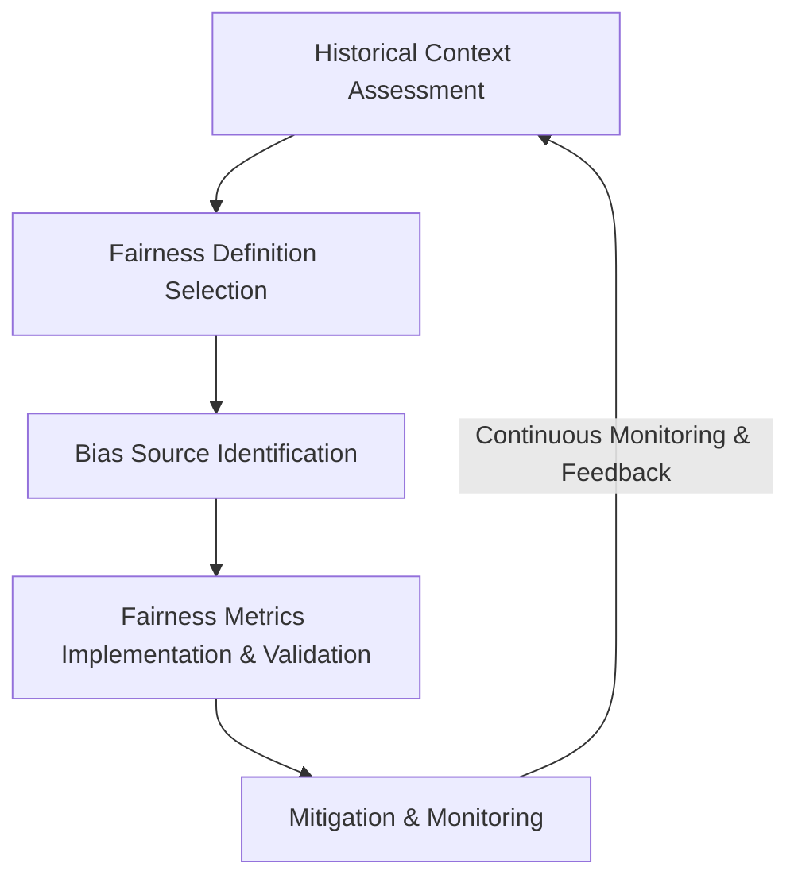

# Fairness Audit Playbook

## Executive Summary

Our organization currently evaluates AI fairness inconsistently across teams. 
Fairness assessments are ad hoc, metrics vary, and there is no centralized standard.

This creates:

- Regulatory exposure
- Reputational risk
- Technical debt
- Inefficient duplication of fairness work
- Inconsistent decision-making across AI systems

To address this, we introduce the **Fairness Audit Playbook** — 
a standardized, reusable, and technically rigorous framework that enables engineering teams to:

- Systematically evaluate AI systems for bias
- Select fairness definitions explicitly
- Identify root bias sources
- Quantitatively measure disparities
- Validate findings statistically
- Document mitigation decisions
- Create ongoing accountability

The Playbook is designed for:
- Internal AI systems
- Third-party AI integrations
- New and legacy systems
- Classification, regression, and ranking models

Most teams can apply the Playbook independently.
Fairness specialists are required only for high-risk or complex systems.

---

# 1. Problem Statement

Our AI systems operate in domains such as finance, hiring, healthcare, and risk assessment.

Across these systems:

- Historical inequities may be embedded in data
- Fairness definitions are often implicit
- Bias sources are not systematically mapped
- Metrics are inconsistently applied
- Intersectional risks are under-evaluated
- Statistical uncertainty is rarely documented

Without a unified framework, fairness becomes reactive rather than systematic.

The Fairness Audit Playbook solves this by integrating four structured components into a cohesive workflow.

---

# 2. Playbook Overview

The Playbook consists of four integrated components:

1. Historical Context Assessment  
2. Fairness Definition Selection  
3. Bias Source Identification  
4. Fairness Metrics Implementation & Validation  

Each component produces outputs that feed directly into the next.

---

# 3. Workflow Integration

## Component 1 → Component 2

Historical Context Assessment identifies:

- Structural inequities
- Historically excluded groups
- Risk patterns
- High-risk intersections

This informs which fairness definitions are appropriate.

→ See: `1_HCAT.md`

---

## Component 2 → Component 3

Fairness Definition Selection determines:

- Which fairness principles apply (e.g., Equal Opportunity, Demographic Parity)
- Which harms are most critical
- Legal and ethical alignment

This defines what risks to trace in bias source mapping.

→ See: `2_FDST.md`

---

## Component 3 → Component 4

Bias Source Identification identifies:

- Data-level bias
- Algorithm-level bias
- Feedback loops
- Deployment risks

This determines what metrics must be implemented and monitored.

→ See: `3_BSIT.md`

---

## Component 4: Quantitative Evaluation

Fairness Metrics Tool translates fairness definitions into:

- Concrete metrics
- Statistical validation
- Intersectional evaluation
- Robustness testing
- Governance documentation

→ See: `04_FMT.md` 

---

# 4. Integrated Workflow Diagram

This linear flow ensures:

- Definitions are not chosen arbitrarily
- Metrics reflect documented risks
- Bias mitigation targets root causes
- Statistical validation supports intervention decisions

---

# 5. Implementation Guide

## 5.1 When to Use the Playbook

Mandatory for:

- High-risk AI systems (finance, hiring, healthcare)
- Systems affecting protected groups
- Models with regulatory exposure
- Major model updates
- New product launches

Optional but recommended for:
- Internal optimization systems
- Third-party AI integrations

---

## 5.2 Required Roles

Minimum team composition:

- ML Engineer
- Domain Expert
- Data Engineer
- Product Owner

High-risk systems additionally require:
- Fairness specialist
- Legal/compliance review

---

## 5.3 Estimated Time Requirements

Low-risk system: 1–2 weeks  
Moderate-risk system: 2–4 weeks  
High-risk system: 4–6 weeks  

Time depends primarily on:
- Data availability
- Intersectional complexity
- Statistical validation requirements

---

## 5.4 Integration with Existing ML Workflow

The Playbook integrates at:

- Model design stage
- Pre-deployment review
- Post-deployment monitoring
- Major retraining cycles

It does not replace model evaluation — it extends it.

---

# 6. Validation Framework

To verify effectiveness of the Playbook:

Teams must demonstrate:

1. Explicit fairness definition selection.
2. Documented bias source mapping.
3. Implemented fairness metrics.
4. Statistical validation of disparities.
5. Intersectional analysis.
6. Documented intervention decisions.
7. Ongoing monitoring plan.

Audit effectiveness is evaluated by:

- Reduction in unexplained disparities over time
- Consistency of fairness documentation across teams
- Stability of fairness metrics under cross-validation
- Decreased reactive fairness incidents

---

# 7. Intersectional Commitment

Intersectional fairness is mandatory at every stage:

- Historical risk identification
- Definition selection
- Bias mapping
- Metric evaluation
- Monitoring

Aggregate fairness is insufficient.

---

# 8. Adaptability Guidelines

The Playbook supports:

| Domain | Key Adaptation |
|--------|----------------|
| Finance | Equal Opportunity + Calibration focus |
| Healthcare | Error balance critical |
| Hiring | Equal Opportunity + Intersectionality |
| Insurance | Calibration + Predictive Parity |
| Public Sector | Demographic Parity + Legal alignment |

Problem type variations:
- Classification → Error rate metrics
- Regression → Residual disparity
- Ranking → Exposure parity

---

# 9. Organizational Benefits

The Playbook:

- Reduces legal risk
- Standardizes fairness processes
- Improves engineering consistency
- Enhances stakeholder trust
- Creates defensible documentation
- Enables proactive bias mitigation

---

# 10. Limitations & Future Improvements

Current limitations:

- Requires demographic data access
- Computational cost for intersectional analysis
- Small-sample statistical instability
- Normative decisions remain unavoidable

Future improvements:

- Automated fairness dashboards
- Model-integrated fairness constraints
- Continuous bias monitoring infrastructure
- Internal fairness training modules

---

# 11. Case Study

See full case study:

`0_Loan_Approval_Case_Study.md`

Demonstrates:

- Full workflow application
- Metric results
- Intersectional findings
- Mitigation plan
- Governance summary

---

# 12. Conclusion

The Fairness Audit Playbook transforms fairness from:

Ad hoc and reactive  
to  
Systematic, measurable, and accountable.

It balances:

Scientific rigor  
Practical usability  
Organizational scalability  

This framework ensures fairness evaluation becomes a standard engineering practice rather than an afterthought.
