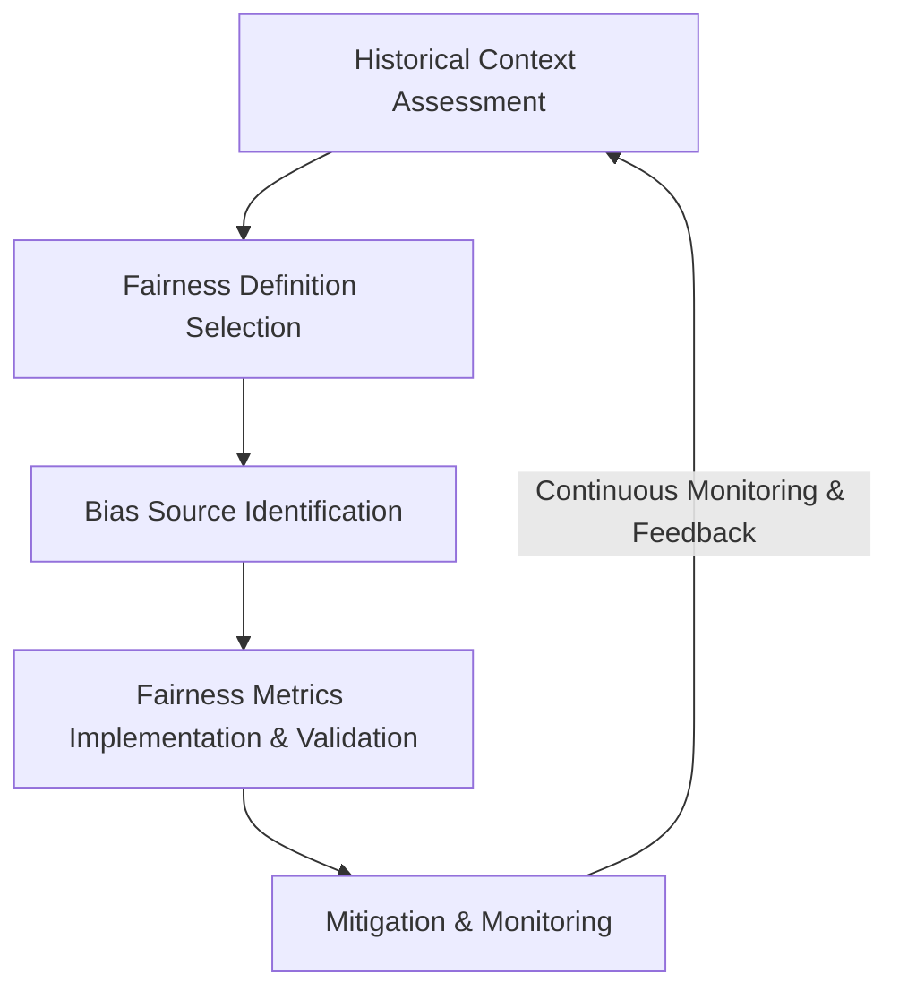

# Fairness Audit Playbook
### Organizational Framework for Systematic AI Fairness Evaluation

## 1. Introduction

AI systems increasingly influence decisions across domains such as finance, hiring, healthcare, and risk assessment. However, fairness evaluation often occurs inconsistently across teams. Definitions remain implicit, bias sources are not systematically mapped, intersectional risks are overlooked, and statistical validation is uneven.

As a result, fairness assessments become reactive rather than structured, creating:

- Regulatory and compliance exposure
- Reputational risk
- Technical debt
- Inconsistent engineering practices
- Weak accountability for fairness outcomes

The **Fairness Audit Playbook** addresses this challenge by providing a standardized, end-to-end framework for evaluating and managing fairness risks in AI systems.

It integrates four structured components:

1. Historical Context Assessment
2. Fairness Definition Selection
3. Bias Source Identification
4. Fairness Metrics Implementation & Validation

Together, these components create a cohesive workflow that ensures fairness is:

- Conceptually grounded
- Quantitatively validated
- Intersectionally evaluated
- Explicitly documented
- Continuously monitored

The Playbook is adaptable across domains, model types (classification, regression, ranking), and risk levels. Most teams can apply it independently, with fairness specialists supporting high-risk or complex systems.

---

## 2. Playbook Overview

The Playbook consists of four integrated components:

1. Historical Context Assessment Tool (HCAT) 
2. Fairness Definition Selection Tool (FDST)
3. Bias Source Identification Tool (BSIT)
4. Fairness Metrics Implementation & Validation Tool (FMT)  

Each component produces outputs that feed directly into the next, forming a structured evaluation pipeline.

---

## 3. Integrated Workflow Diagram
### Component Flow

### Information Flow Between Components

### 1. Historical Context → Fairness Definitions

Historical Context Assessment identifies:

- Structural inequities
- Historically excluded groups
- Risk patterns
- High-risk intersections

This informs which fairness definitions are appropriate.

→ See: `1_HCAT.md`

---

## 2. Fairness Definitions → Bias Source Identification

Fairness Definition Selection determines:

- Which fairness principles apply (e.g., Equal Opportunity, Demographic Parity)
- Which harms are most critical
- Legal and ethical alignment

This defines what risks to trace in bias source mapping.

→ See: `2_FDST.md`

---

## 3. Bias Sources → Fairness Metrics

Identified bias sources determine:

- Which metrics must be implemented
- Which subgroups require intersectional analysis
- Which features require causal testing
- Where statistical validation must focus

This determines what metrics must be implemented and monitored.

→ See: `3_BSIT.md`  
→ See: `4_FMT.md`

---

## 4. Implementation Guide

### 4.1 When to Use the Playbook

Mandatory for:

- High-risk AI systems (finance, hiring, healthcare)
- Systems influencing access to opportunities or resources
- Systems operating in regulated domains
- Major model updates or retraining

Optional but recommended for:
- Internal optimization systems
- Third-party AI integrations

---

### 4.2 Required Roles

Minimum team composition:

- ML Engineer
- Domain Expert
- Data Engineer
- Product Owner

High-risk systems additionally require:
- Fairness specialist
- Legal/compliance representative

---

### 4.3 Estimated Time Requirements

Low-risk system: 1–2 weeks  
Moderate-risk system: 2–4 weeks  
High-risk system: 4–6 weeks  

Time depends primarily on:
- Data availability
- Intersectional complexity
- Statistical validation requirements

---

### 4.4 Integration with Existing ML Workflow

The Playbook integrates at:

- Model design stage
- Pre-deployment review
- Post-deployment monitoring
- Major retraining cycles

It does not replace model evaluation — it extends it.

---

## 5. Validation Framework

To verify effectiveness of the Playbook:

Teams must demonstrate:

1. Explicit fairness definition selection.
2. Documented bias source mapping.
3. Implemented fairness metrics.
4. Statistical validation of disparities.
5. Intersectional analysis.
6. Documented intervention decisions.
7. Ongoing monitoring plan.

Audit effectiveness is evaluated by:

- Reduction in unexplained disparities over time
- Consistency of fairness documentation across teams
- Stability of fairness metrics under cross-validation
- Decreased reactive fairness incidents

---

## 6. Intersectional Commitment

Intersectional fairness is mandatory at every stage:

- Historical risk identification
- Definition selection
- Bias mapping
- Metric evaluation
- Monitoring

Aggregate fairness is insufficient.

---

## 7. Adaptability Guidelines

The Playbook supports:

| Domain | Key Adaptation |
|--------|----------------|
| Finance | Equal Opportunity + Calibration focus |
| Healthcare | Error balance critical |
| Hiring | Equal Opportunity + Intersectionality |
| Insurance | Calibration + Predictive Parity |
| Public Sector | Demographic Parity + Legal alignment |

Problem type variations:
- Classification → Error rate metrics
- Regression → Residual disparity
- Ranking → Exposure parity

---

## 8. Organizational Benefits

The Playbook:

- Reduces legal risk
- Standardizes fairness processes
- Improves engineering consistency
- Enhances stakeholder trust
- Creates defensible documentation
- Enables proactive bias mitigation

---

## 9. Limitations & Future Improvements

Current limitations:

- Requires demographic data access
- Computational cost for intersectional analysis
- Small-sample statistical instability
- Normative decisions remain unavoidable

Future improvements:

- Automated fairness dashboards
- Model-integrated fairness constraints
- Continuous bias monitoring infrastructure
- Internal fairness training modules

---

## 10. Case Study

See full case study through steps:

`1_HCAT_Applied_Example.md`  
`2_FDST_Applied_Example.md`  
`3_BSIT_Applied_Example.md`  
`4_FMT_Applied_Example.md`  

Demonstrates:

- Full workflow application
- Metric results
- Intersectional findings
- Mitigation plan
- Governance summary

---

## 11. Conclusion

The Fairness Audit Playbook transforms fairness from ad hoc and reactive to systematic, measurable, and accountable.  

It balances:

- Scientific rigor  
- Practical usability  
- Organizational scalability  

This framework ensures fairness evaluation becomes a standard engineering practice rather than an afterthought.
