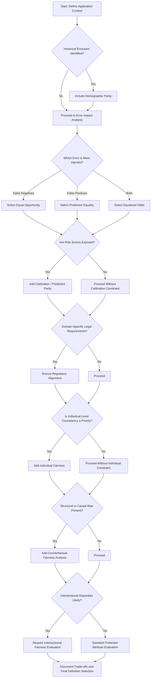

# Fairness Definition Selection Tool

## 1. Introduction

The Fairness Definition Selection Tool helps teams **select appropriate fairness definitions for AI systems** based on application context, historical patterns, stakeholder priorities, legal requirements, and technical constraints.

Because fairness definitions reflect different values and are often mathematically incompatible, choosing one is not purely a technical decision.  
The tool ensures that fairness metric selection is explicit, justified, and documented.

As the second component of the Fairness Audit Playbook, it is **applied after the Historical Context Assessment and before model optimization**.

## 2. Objectives
- Translate abstract fairness definitions into practical selection criteria
- Map application characteristics to appropriate fairness definitions
- Make fairness trade-offs explicit and documented
- Align fairness metric selection with legal and ethical constraints
- Provide a structured method for navigating incompatibilities

## 3. Tool Overview
The Fairness Definition Selection Tool consists of four components:
1. **Fairness Definition Catalog**  
A concise reference of key fairness definitions, their mathematical formulations, philosophical foundations, and appropriate use cases.

2. **Definition Selection Decision Tree**  
A structured process for mapping application context to fairness definitions.

3. **Trade-Off Analysis Template**  
A documentation framework for recording selection rationale and acknowledging incompatibilities.

4. **Applied Example**  
Demonstrates how the tool can be implemented in a real system. (Internal loan application system).

---

## 4. Fairness Definition Selection Tool

### 4.1 Fairness Definition Catalog

---
#### Group Fairness Definitions
---

### 1. Demographic Parity

**Definition:** Equal probability of a positive outcome across protected groups.  
**Formula:** P(Ŷ = 1 | A = a) = P(Ŷ = 1 | A = b)  
**Philosophical Basis:** Egalitarian, outcome equality.  

**Use When:**
- Addressing historical exclusion  
- Representation is a priority  
- Base rates reflect structural disadvantage  

**Limitations:**
- May reduce overall accuracy  
- Ignores qualification differences  
- Often incompatible with calibration when base rates differ  

**Example:**  
A loan system approves applicants from different demographic groups at equal rates to counteract historical under-lending, regardless of differing historical default rates.

---

### 2. Equal Opportunity

**Definition:** Qualified individuals have equal probability of receiving a positive outcome across groups.  
**Formula:** P(Ŷ = 1 | Y = 1, A = a) = P(Ŷ = 1 | Y = 1, A = b)  
**Philosophical Basis:** Meritocratic fairness, equal treatment of the qualified.  

**Use When:**  
- False negatives are most harmful
- Historical bias denied qualified individuals access
- Ground truth labels are reasonably reliable  
  *(The data used to define who is truly qualified or successful is accurate and not strongly influenced by past bias or unfair conditions.)*

**Limitations:**  
- Does not constrain false positive disparities
- Depends on trustworthy ground truth
- May conflict with predictive parity

**Example:**  
A lending system ensures that applicants who would repay their loans have equal approval rates across demographic groups.

---

### 3. Equalized Odds

**Definition:** Both true positive and false positive rates are equal across protected groups.  
**Formula:** P(Ŷ = 1 | Y = y, A = a) = P(Ŷ = 1 | Y = y, A = b) for y ∈ {0,1}  
**Philosophical Basis:** Balanced error distribution across groups.   

**Use When:**  
- Both error types create significant harm
- High-stakes decisions require balanced protection

**Limitations:**  
- Strong trade-offs with accuracy
- Harder to implement
- Often incompatible with calibration when base rates differ

**Example:**  
A loan model ensures that both wrongly rejecting qualified applicants and wrongly approving risky applicants happen at similar rates across demographic groups.

---

### 4. Predictive Parity (Calibration Within Groups)

**Definition:** Predicted positives have equal outcome reliability across groups.  
**Formula:** P(Y = 1 | Ŷ = 1, A = a) = P(Y = 1 | Ŷ = 1, A = b)  
**Philosophical Basis:** Consistent meaning of risk scores  

**Use When:**  
- Risk scores drive downstream decisions
- Financial, insurance, or scoring systems require calibration
- Interpretability of scores is important

**Limitations:**  

- Incompatible with equal error rates when base rates differ
- May preserve structural disparities in outcomes

**Example:** 
If a loan system predicts “low default risk,” that prediction should correspond to the same actual repayment rate across demographic groups.

---
#### Individual and Causal Fairness Definitions
---

### 5. Individual Fairness

**Definition:** Similar individuals receive similar predictions.  
**Core Idea:** Differences in outcomes must be justified by relevant differences in features.  
**Philosophical Basis:** Procedural fairness, treatment consistency  

**Use When:**
- Case-by-case evaluation is central
- Strong procedural fairness expectations
- Group-level parity may be inappropriate

**Limitations:**
- Requires defining similarity metric
- May preserve group disparities
- Hard to operationalize in complex domains

**Example:**  
Two loan applicants with nearly identical financial profiles should receive similar approval decisions, regardless of demographic background.

---

### 6. Counterfactual Fairness

**Definition:** A prediction is fair if it would remain the same for an individual in a hypothetical world where their protected attribute were different, while all other relevant factors remain unchanged.  
**Core Idea:** The outcome should not change solely because a protected attribute changes in a counterfactual scenario.  
**Philosophical Basis:** Causal fairness, protection against discrimination through indirect pathways  

**Use When:**
- Protected attributes influence other features through historical or structural bias
- Understanding causal relationships is important
- Group-level metrics are insufficient to capture fairness concerns
- Decisions have high individual-level impact

**Limitations:**
- Requires building a causal model
- Complex to implement and validate
- Depends on assumptions about which causal pathways are legitimate

**Example:**  
A loan decision would remain the same if the applicant’s race were hypothetically different, assuming income, employment, and other legitimate factors remained unchanged.

---

### 4.2 Definition Selection Decision Tree

### Step 1: Historical Context Alignment

**Question**: Did the Historical Context Assessment reveal systemic exclusion or underrepresentation?
- **If Yes** → Include demographic parity as a required fairness definition. Then proceed to Step 2.
- **If No** → Proceed to Step 2.   

### Step 2: Error Impact Assessment

**Question**: Which error type causes greater harm?
- **If false negatives(FN) are more harmful** → Prioritize Equal Opportunity.
- **If false positives(FP) are more harmful** → Prioritize Predictive Equality.
- **If both are critical** → Prioritize Equalized Odds.

### Step 3: Score Exposure and Calibration

**Question**: Are probabilistic scores exposed to users or downstream systems?
- **If Yes** → Include Predictive Parity or Calibration.
- **If No** → Proceed without calibration constraint.

### Step 4: Legal Requirements

**Question**: Are there domain-specific legal requirements?
- **If Yes** → Ensure selected definitions satisfy relevant regulatory standards and protected attribute obligations.
- **If No** → Proceed.

### Step 5: Individual-Level Consistency

**Question**: Is treating similar individuals similarly a primary fairness concern in this domain?
- **If Yes** → Include Individual Fairness alongside selected group definitions.
- **If No** → Proceed without individual-level constraint.

### Step 6: Causal and Structural Bias Analysis

**Question**: Do protected attributes influence other features through structural or historical pathways?
- **If Yes** → Include Counterfactual Fairness analysis or causal modeling review.
- **If No** → Proceed with selected definitions.

### Step 7: Intersectional Considerations

**Question**: Are disparities likely at demographic intersections?
- **If Yes** → Require intersectional fairness evaluation regardless of primary definition selected.
- **If No** → Standard protected attribute evaluation is sufficient.

---

### 4.2.1 Definition Selection Decision Tree Diagram 

---

### 4.3 Trade-Off Analysis Template

### 1. Application Context
- System name:
- Decision domain:
- Stakeholders identified:
- Protected attributes evaluated:

### 2. Historical Context Summary
- Key historical patterns identified:
- Structural risks relevant to this system:
- Was systemic exclusion identified? ☐ Yes ☐ No
- If yes, was Demographic Parity included? ☐ Yes ☐ No

### 3. Selected Fairness Definitions

**Primary Fairness Definition:**
- Name:
- Mathematical formulation:
- Why selected in this context:

**Secondary Fairness Definitions (if applicable):**
- ☐ Calibration / Predictive Parity
- ☐ Individual Fairness
- ☐ Counterfactual Fairness
- ☐ Additional (specify):

Rationale for inclusion of secondary definitions:

### 4. Error Harm Analysis
- Which error type is most harmful? ☐ FN ☐ FP ☐ Both
- Explanation of harm asymmetry:
- How this influenced fairness definition selection:

### 5. Trade-Off Documentation

**Known Mathematical Tensions Identified:**
- (e.g., Equal Opportunity vs Calibration)

**Definitions Not Selected and Why:**
- Definition:
- Reason for deprioritization:

**Expected Performance Impact:**
- Accuracy impact:
- Operational impact:
- Stakeholder impact:

### 6. Legal and Regulatory Alignment
- Relevant laws or regulations:
- Does selected definition align with legal standards? ☐ Yes ☐ No
- Compliance considerations:

### 7. Individual-Level and Causal Review
- Was individual-level consistency a concern? ☐ Yes ☐ No
- Was structural or causal bias identified? ☐ Yes ☐ No
- If yes, how addressed:

### 8. Intersectional Evaluation
- Were intersectional disparities assessed? ☐ Yes ☐ No
- Key findings:
- Mitigation steps (if needed):

### 9. Monitoring Plan
- Metrics to be tracked:
- Frequency of review:
- Responsible team:
- Conditions that trigger re-evaluation:

---

### 4.4 Usage Guide

The Fairness Definition Selection Tool should be applied after completing the Historical Context Assessment and before model optimization.  
The tool does not assume that a single fairness definition is sufficient; multiple complementary definitions may be selected depending on domain risk.

#### Step 1: Complete Historical Context Assessment
- Identify structural inequalities, historical exclusion patterns, and relevant protected attributes.

#### Step 2: Analyze Error Harm
- Determine whether false positives, false negatives, or both create greater harm.  
- Use this analysis to select the primary group fairness definition.

#### Step 3: Evaluate Score Exposure
- If probabilistic scores are exposed to users or downstream systems, include calibration or predictive parity considerations.

#### Step 4: Assess Individual-Level Fairness Needs
- Determine whether treating similar individuals similarly is central in this domain.  
- If yes, include Individual Fairness alongside group-level metrics.

#### Step 5: Conduct Structural and Causal Bias Review
- Assess whether protected attributes influence other features through historical or structural pathways.  
- If yes, include Counterfactual Fairness analysis or causal modeling.

#### Step 6: Verify Legal Requirements
- Ensure selected fairness definitions align with relevant regulatory frameworks and protected attribute obligations.

#### Step 7: Perform Intersectional Evaluation
- Assess fairness across intersections of protected attributes, not only single categories.

#### Step 8: Document Trade-Offs
- Explicitly document:
  - Mathematical incompatibilities
  - Rationale for prioritization
  - Definitions not selected
  - Anticipated impacts on stakeholders
 
All decisions must be explicitly justified and documented.

---

### 2_FDST_Applied_Example

