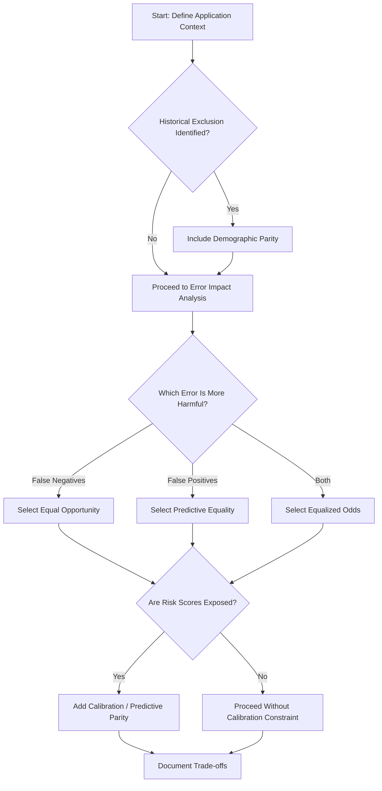

# Fairness Definition Selection Tool

## 1. Introduction

The Fairness Definition Selection Tool helps teams **select appropriate fairness definitions for AI systems** based on application context, stakeholder priorities, legal requirements, and technical constraints.

Because fairness definitions reflect different values and are often mathematically incompatible, choosing one is not purely a technical decision.  
The tool ensures that fairness metric selection is explicit, justified, and documented.

As the second component of the Fairness Audit Playbook, it is **applied after the Historical Context Assessment and before model optimization**.

## 2. Objectives
- Translate abstract fairness definitions into practical selection criteria
- Map application characteristics to appropriate fairness definitions
- Make fairness trade-offs explicit and documented
- Align fairness metric selection with legal and ethical constraints
- Provide a structured method for navigating incompatibilities

## 3. Tool Overview
The Fairness Definition Selection Tool consists of four components:
1. **Fairness Definition Catalog**  
A concise reference of key fairness definitions, their mathematical formulations, philosophical foundations, and appropriate use cases.

2. **Definition Selection Decision Tree**  
A structured process for mapping application context to fairness definitions.

3. **Trade-Off Analysis Template**  
A documentation framework for recording selection rationale and acknowledging incompatibilities.

4. **Applied Example**  
Demonstrates how the tool can be implemented in a real system. (Internal loan application system).

---

## 4. Fairness Definition Selection Tool

### 4.1 Fairness Definition Catalog
### Demographic Parity

**Definition:** Equal probability of a positive outcome across protected groups.  
**Formula:** P(Ŷ = 1 | A = a) = P(Ŷ = 1 | A = b)  
**Philosophical Basis:** Egalitarian, outcome equality.  

**Use When:**
- Addressing historical exclusion  
- Representation is a priority  
- Base rates reflect structural disadvantage  

**Limitations:**
- May reduce overall accuracy  
- Ignores qualification differences  
- Often incompatible with calibration when base rates differ  

---

### Equal Opportunity

**Definition:** Qualified individuals have equal probability of receiving a positive outcome across groups.  
**Formula:** P(Ŷ = 1 | Y = 1, A = a) = P(Ŷ = 1 | Y = 1, A = b)  
**Philosophical Basis:** Meritocratic fairness, equal treatment of the qualified.  

**Use When**  
- False negatives are most harmful
- Historical bias denied qualified individuals access
- Ground truth labels are reasonably reliable  
  *(The data used to define who is truly qualified or successful is accurate and not strongly influenced by past bias or unfair conditions.)*

**Limitations**  
- Does not constrain false positive disparities
- Depends on trustworthy ground truth
- May conflict with predictive parity

---

### Equalized Odds

**Definition:** Both true positive and false positive rates are equal across protected groups.  
**Formula:** P(Ŷ = 1 | Y = y, A = a) = P(Ŷ = 1 | Y = y, A = b) for y ∈ {0,1}  
**Philosophical Basis:** Balanced error distribution across groups.   

**Use When**  
- Both error types create significant harm
- High-stakes decisions require balanced protection

**Limitations**  
- Strong trade-offs with accuracy
- Harder to implement
- Often incompatible with calibration when base rates differ  

---

### Predictive Parity (Calibration Within Groups)

**Definition:** Predicted positives have equal outcome reliability across groups.  
**Formula:** P(Y = 1 | Ŷ = 1, A = a) = P(Y = 1 | Ŷ = 1, A = b)  
**Philosophical Basis:** Consistent meaning of risk scores  

**Use When**  
- Risk scores drive downstream decisions
- Financial, insurance, or scoring systems require calibration
- Interpretability of scores is important

**Limitations**  

- Incompatible with equal error rates when base rates differ
- May preserve structural disparities in outcomes

---

### Individual Fairness

**Definition:** Similar individuals receive similar predictions.  
**Core Idea:** Differences in outcomes must be justified by relevant differences in features.  
**Philosophical Basis:** Procedural fairness, treatment consistency  

**Use When**
- Case-by-case evaluation is central
- Strong procedural fairness expectations
- Group-level parity may be inappropriate

**Limitations**
- Requires defining similarity metric
- May preserve group disparities
- Hard to operationalize in complex domains

---

### 4.2 Definition Selection Decision Tree

### Step 1: Historical Context Alignment

**Question**: Did the Historical Context Assessment reveal systemic exclusion or underrepresentation?
- **If Yes** → Include Demographic Parity as either a primary or secondary fairness definition. Then proceed to Step 2.
- **If No** → Proceed to Step 2.   

### Step 2: Error Impact Assessment

**Question**: Which error type causes greater harm?
- **If false negatives are more harmful** → Prioritize Equal Opportunity.
- **If false positives are more harmful** → Prioritize Predictive Equality.
- **If both are critical** → Prioritize Equalized Odds.

### Step 3: Score Exposure and Calibration

**Question**: Are probabilistic scores exposed to users or downstream systems?
- **If Yes** → Include Predictive Parity or Calibration.
- **If No** → Proceed without calibration constraint.

### Step 4: Legal Requirements

**Question**: Are there domain-specific legal requirements?
- **If Yes** → Ensure selected definitions satisfy relevant regulatory standards.

### Step 5: Intersectional Considerations

**Question**: Are disparities likely at demographic intersections?
- **If Yes** → Require intersectional fairness evaluation regardless of primary definition selected.

---

### 4.2.1 Definition Selection Decision Tree Diagram 

---

### 4.3 Trade-Off Analysis Template

**Selected Primary Fairness Definition**  
[Definition Name]

**Mathematical Formulation**

**Rationale for Selection**
- Historical context alignment
- Error impact analysis
- Stakeholder priorities
- Legal considerations

**Fairness Properties Not Satisfied**
- List definitions deprioritized
- Explain trade-offs

**Performance Implications**
- Expected accuracy impact
- Operational cost impact

**Monitoring Plan**
- Primary fairness metric
- Secondary monitoring metrics
- Intersectional tracking

---

### 4.4 Usage Guide

**Step 1**  
- Review outputs from Historical Context Assessment Tool.

**Step 2**  
- Complete decision tree collaboratively with engineering, product, and compliance stakeholders.

**Step 3**  
- Document trade-offs using template.

**Step 4**  
- Integrate selected fairness definitions into model training and evaluation.  

Outputs from FDST guide fairness metric implementation and mitigation strategies.
