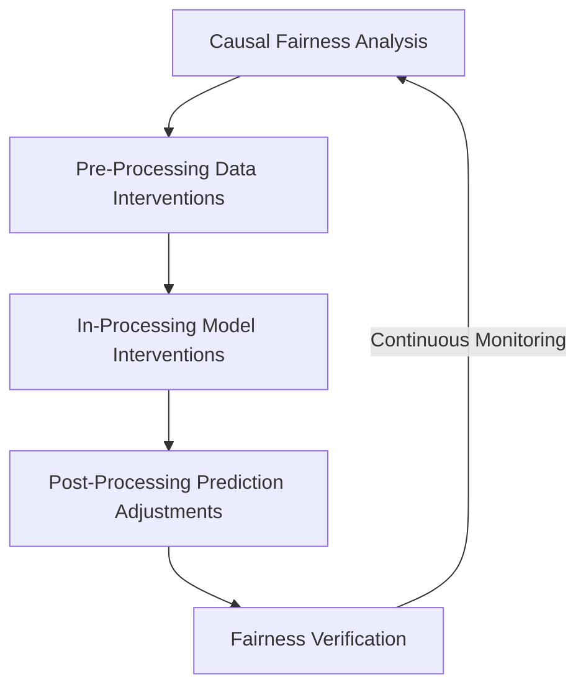

# Fairness Intervention Playbook
### Organizational Framework for Systematic AI Fairness Intervention

## 1. Introduction

The **Fairness Intervention Playbook** is a practical decision-making guide for choosing and evaluating technical fairness interventions.  

It helps you:  
- **Turn diagnosis into action** - move from audit findings to concrete solutions
- **Select the right intervention point** - data, model, or post-processing
- **Match techniques to specific bias patterns**
- **Combine multiple approaches when needed**
- **Align interventions with your fairness definitions and constraints**

Rather than offering one universal fix, the playbook guides you through a structured selection process based on:  

- Defined fairness criteria
- The identifies bias sources
- Technical and operational limitations

---

## 2. Playbook Overview

The Playbook consists of four integrated components:

1. Causal Fairness Toolkit ([CAUS]())
2. Pre-Processing Fairness Toolkit ([PREP]())
3. In-Processing Fairness Toolkit ([INPR]())
4. Post-Processing Fairness Toolkit ([POST]())

Each toolkit addresses fairness at a different stage of the machine learning pipeline.

| Stage | Toolkit | Purpose |
|------|--------|--------|
| Bias Diagnosis | Causal Fairness Toolkit | Identify causal mechanisms behind disparities |
| Data Intervention | Pre-Processing Fairness Toolkit | Correct bias in training datasets |
| Model Intervention | In-Processing Fairness Toolkit | Embed fairness constraints into model training |
| Prediction Intervention | Post-Processing Fairness Toolkit | Adjust predictions without retraining models |

Each component produces outputs that feed directly into the next, forming a **structured mitigation pipeline**.
 
---

## 3. Integrated Workflow Diagram
### Component Flow

This workflow ensures fairness interventions are applied **systematically rather than reactively**.

---

## 4. Information Flow Between Components

### 1. Causal Analysis → Data Interventions

The **Causal Fairness Toolkit** identifies:

- How protected attributes influence predictions
- Which variables transmit structural bias
- Which causal pathways are legitimate or problematic

These insights determine **where bias originates** and guide appropriate data-level interventions.

→ See: `1_CFT.md`

---

### 2. Data Interventions → Model Training Adjustments

The **Pre-Processing Toolkit** mitigates dataset bias by:

- correcting representation imbalances
- transforming proxy variables
- addressing label bias
- generating fairness-aware training data

The resulting dataset provides a **fairer foundation for model training**.

→ See: `2_PFT.md`

---

### 3. Model Training → Prediction Adjustments

The **In-Processing Toolkit** integrates fairness directly into the training process by:

- adding fairness constraints
- introducing fairness regularization
- applying adversarial debiasing
- optimizing fairness–performance trade-offs

These methods reduce bias within the **model’s learned decision boundaries**.

→ See: `3_IPT.md`

---

### 4. Prediction Adjustments → Deployment

The **Post-Processing Toolkit** modifies predictions when:

- retraining is not feasible
- legacy models must be maintained
- fairness gaps remain after training interventions

Techniques include:

- threshold optimization
- calibration
- score transformations
- rejection classification

These methods improve fairness **without changing the underlying model**.

→ See: `4_PPT.md`

---

## 5. Implementation Guide

### 5.1 When to Use the Playbook

Mandatory for:

- AI systems making **financial, healthcare, hiring, or legal decisions**
- Systems influencing **access to opportunities or resources**
- Systems operating in **regulated industries**
- Major model updates or retraining

Recommended for:

- Large-scale recommendation systems
- Risk scoring models
- Third-party AI integrations
- Internal decision support tools

---

### 5.2 Required Roles

Minimum team composition:

- ML Engineer
- Data Engineer
- Domain Expert
- Product Owner

High-risk systems additionally require:

- Fairness specialist
- Legal or compliance representative

---

### 5.3 Estimated Time Requirements

Low-complexity system: **1–2 weeks**

Moderate-complexity system: **2–4 weeks**

High-risk system: **4–6 weeks**

Time requirements depend primarily on:

- data availability
- causal modeling complexity
- intersectional analysis requirements
- regulatory documentation needs

---

### 5.4 Integration with Existing ML Workflow

The Playbook integrates with standard ML development stages:

- **Model design**
- **Training pipeline development**
- **Pre-deployment review**
- **Post-deployment monitoring**
- **Model retraining cycles**

It does not replace model evaluation — it **extends it with fairness-specific intervention workflows**.

---

## 6. Validation Framework

To verify effectiveness of fairness interventions, teams must demonstrate:

1. Documented causal analysis of disparities  
2. Implemented data-level mitigation strategies  
3. Fairness-aware model training or prediction adjustments  
4. Measured fairness improvements across demographic groups  
5. Intersectional subgroup evaluation  
6. Documented fairness–performance trade-offs  
7. Continuous monitoring plan

Effectiveness is evaluated through:

- reduction of fairness disparities
- stability of fairness metrics across validation splits
- reproducibility of intervention outcomes
- consistency across demographic subgroups

---

## 7. Intersectional Commitment

Intersectional fairness is evaluated at every stage of the Playbook:

- causal pathway analysis
- dataset auditing
- model fairness evaluation
- prediction adjustments
- monitoring

Evaluating fairness only at the aggregate group level can hide disparities affecting **intersectional subgroups**.

Therefore, the Playbook requires:

- subgroup-level analysis
- intersectional fairness metrics
- targeted interventions when needed

---

## 8. Adaptability Guidelines

The Playbook is designed to adapt across domains.

| Domain | Key Intervention Focus |
|------|----------------|
| Finance | Equal Opportunity and calibration |
| Healthcare | Error balance across groups |
| Hiring | Equal Opportunity with intersectional monitoring |
| Insurance | Calibration and predictive parity |
| Public Sector | Demographic parity and legal compliance |

Different machine learning tasks require adapted interventions.

| Problem Type | Adaptation |
|--------------|-----------|
| Classification | Error-rate parity and threshold optimization |
| Regression | Residual disparity analysis |
| Ranking | Exposure fairness and score transformations |

---

## 9. Organizational Benefits

Implementing the Fairness Intervention Playbook enables organizations to:

- Standardize fairness mitigation practices
- Reduce legal and regulatory risk
- Improve engineering consistency
- Enable proactive bias mitigation
- Increase transparency in AI decision systems
- Build stakeholder trust in AI technologies

The Playbook transforms fairness mitigation from **ad hoc experimentation into a systematic engineering process**.

---

## 10. Limitations & Future Improvements

Current limitations include:

- Dependence on access to demographic attributes
- Increased computational costs for intersectional analysis
- Limited interpretability of some fairness techniques
- Remaining normative judgments in fairness decisions

Future improvements may include:

- automated fairness intervention dashboards
- continuous bias monitoring systems
- model-integrated fairness constraints
- organizational training programs for fairness-aware development

---

## 11. Case Study

A full case study demonstrating the Playbook in practice is available:

`Case_Study_Loan_Fairness.md`

The case study illustrates:

- causal bias diagnosis
- dataset fairness corrections
- fairness-aware model training
- prediction-level interventions
- evaluation of fairness improvements

---

## 12. Conclusion

The **Fairness Intervention Playbook** provides a structured framework for moving from **fairness assessment to fairness action**.

It enables organizations to systematically:

- diagnose bias
- implement targeted interventions
- evaluate fairness improvements
- maintain fairness over time

By integrating causal analysis, data interventions, model training adjustments, and prediction-level corrections, the Playbook transforms fairness mitigation into a **repeatable and scalable engineering practice**.

