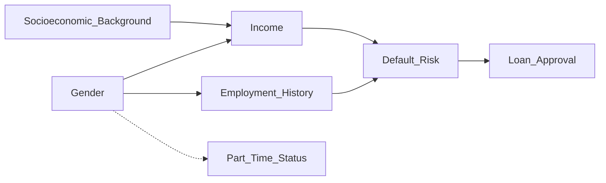

# Causal Fairness Toolkit
A Practical Methodology for Identifying and Fixing Algorithmic Bias

## 1. Introduction

Machine learning systems sometimes produce different outcomes for different groups of people. But seeing a difference does not automatically tell us whether the system is unfair - or what is causing the difference.  

Disparities can happen for many reasons. A model might directly use a protected attribute (like gender), rely on variables that indirectly reflect it (such as job type or part-time status), reflect patterns from historical inequality, or use legitimate risk factors. Without understanding the real cause, fairness fixes may only treat the symptoms instead of solving the problem.  

The **Causal Fairness Toolkit provides a practical step-by-step method to help teams understand where unfairness comes from and how to address it properly**. It helps teams:   

- Map how protected attributes may influence predictions
- Check whether a decision would change **if only a protected attribute were different, while everything else stayed the same**.
- Separate legitimate prediction factors from discriminatory ones
- Choose the right place in the system to intervene
- Make thoughtful decisions even when information is incomplete

Instead of applying simple statistical adjustments, this toolkit focuses on understanding the reasons behind disparities so that interventions are more precise, transparent, and effective.  

## 2. Toolkit Overview 

The toolkit consists of four components:

- 3.1 Causal Modeling Template   
- 3.2 Counterfactual Analysis Framework   
- 3.3 Intervention Point Identification Method   
- 3.4 Limited Information Adaptation Guidelines    

Each step builds on the previous one.

## 3. Causal Modeling Template

#### Goal
Map how protected attributes influence predictions.

---

### 3.1 Variable Identification Template

---

### A. Protected Attributes Identification
1. **Primary protected attributes:** [List legally protected attributes _(e.g., gender, race, age)_]
2. **Intersectional categories:** [Include intersectional groups where relevant _(e.g., gender × age)_]

Document why each attribute is relevant in this context.  

---

### B. Mediator Variable Identification
Mediators are variables that are influenced by protected attributes and also influence the outcome. These variables may transmit structural inequalities.  
1. **Variables directly influenced by protected attributes:**  [List variables _(e.g., employment history, income level)_]
2. **Evidence for causal relationship:**  [Provide brief justification for each variable - domain expertise, research findings, or data patterns _(e.g., research on wage gaps, observed career breaks)_]

For each mediator, consider:  
- Does this variable reflect historical or structural inequality?
- Should its influence on the outcome be preserved or adjusted?

---

### C. Confounding Variable Identification
Confounders are variables that influence both protected attributes and outcomes, potentially creating misleading associations.
1. **Variables that may affect both protected attributes and outcomes:** [List variables _(e.g., socioeconomic background, neighborhood economic conditions)_]
2. **Evidence for confounding role:** [List evidences _(e.g., research linking socioeconomic status to both education and loan approval)_]

For each potential confounder, consider:
- Does this variable create a spurious relationship?
- Is it measured in the data?
- Could omitting it bias fairness conclusions?

---

### D. Proxy Variable Identification
Proxy variables are correlated with protected attributes and may indirectly encode them.  
1. **Variables correlated with protected attributes:**  [List variables _(e.g., part-time employment status, zip code)_]
2. **Evidence for correlation:**  [Brief justification per variable _(e.g., statistical correlation, labor market patterns)_]
3. **Common causes explaining correlation:**  [Explanation per variable _(e.g., occupational segregation, residential segregation)_]

---

### E. Outcome Variable Identification
Define the system’s decision or prediction.  
1. **Decisions or predictions made by the system:** [List outcomes (e.g., loan approval decision, risk score)]
2. **Evaluation metrics used:** [List metrics _(e.g., approval rate, default rate, accuracy)_]

---

### F. Legitimate Predictor Identification
Variables that should influence the outcome because they are directly related to the task.

1. **Variables that should influence outcomes:** [List variables _(e.g., debt-to-income ratio, savings history, payment history)_]
2. **Justification for legitimacy:** [Brief justification per variable _(e.g., directly measures repayment ability)_]

Document justification for each variable.

---

### 3.2 Causal Graph Construction

---

After identifying variables, construct a **Directed Acyclic Graph (DAG)** to visually represent how variables influence one another.  

- **Use directed arrows to represent causal relationships.**  
  _Example:_  
  Gender → Employment History → Default Risk → Loan Approval  
  (Gender may influence employment history, which affects default risk.)

- **Use bidirectional dashed arrows to represent correlations without direct causation.**  
  _Example:_  
  Gender ↔ Part-Time Status  
  (Part-time work may correlate with gender, but gender does not directly “cause” part-time status in a strict biological sense — both may reflect broader social patterns.)

- **Distinguish node types visually (when drawing the graph):**
  - Protected attributes: [e.g., Gender]
  - Mediators: [e.g., Income Level, Employment History]
  - Proxy variables: [e.g., Industry Sector]
  - Confounders: [e.g., Socioeconomic Background]
  - Outcomes: [e.g., Loan Approval Decision]

- **Document causal assumptions with justification for each arrow.**  
  _Example justification:_   
  - "Gender → Income" based on documented wage gap research.  
  - "Income → Default Risk" based on financial risk modeling evidence.

- **Identify critical paths that may transmit discrimination.**  
  _Example critical paths:_  
  - Gender → Income → Debt-to-Income Ratio → Approval  
  - Gender → Employment Gap → Risk Score → Approval  

These paths should later be evaluated through counterfactual analysis to determine whether they represent legitimate influence or discrimination.

Legend:
- `-->` = causal relationship  
- `-.->` = correlation / proxy relationship

---

## 4. Counterfactual Analysis Framework

#### Goal  

Test whether predictions would change if only the protected attribute changed.  

---

### 4.1 Counterfactual Query Structure  

---

1. **Base case description**
   Describe the real individual and the model’s actual decision.  
   - **Individual characteristics:** [Relevant non-protected attributes]
       _Example: [Credit score: 720, Income: €45,000, Debt-to-income ratio: 28%, Savings: €12,000, 2-year employment gap]_
   - **Protected attribute value:** [Current value]
   - **System prediction:** [Current prediction/decision]

---

2. **Counterfactual scenario:**
   - **Modified protected attribute:** [Counterfactual value]
   - **Variables that should remain constant:** [List causally independent variables]
   - **Variables that should change:** [List descendants of protected attributes] 

---

3. **Fairness evaluation:**
   - **Expected outcome under counterfactual:** [Prediction if fair]
   - **Actual model behavior:** [What model actually does]
   - **Discrepancy analysis:** [Compare expected vs. actual]

- Did prediction change?  
- If yes → potential counterfactual unfairness

---  

## Example

Question:
> Would this applicant be approved if they were male instead of female, keeping debt-to-income ratio and savings constant?

If approval changes → causal discrimination likely exists.

---

## 4.2 Path-Specific Analysis

Break total effect into pathways:

Example:
- Gender → Income → Approval
- Gender → Employment history → Approval

Classify each pathway:
- Legitimate
- Unfair
- Contested

Quantify contribution of each path when possible.

---

# 5. Step 3 — Intervention Point Identification

Use this decision structure:

---

## A. Direct Discrimination
Protected attribute directly affects outcome.

Action:
- Remove attribute
- Add fairness constraints during training

---

## B. Proxy Discrimination
Protected attribute influences outcome via correlated but irrelevant variable.

Action:
- Transform or remove proxy variable (pre-processing)
- Apply adversarial debiasing (in-processing)

---

## C. Mediator Discrimination
Protected attribute affects intermediate variables.

If mediator is:
- Legitimate → consider path-specific fairness
- Not legitimate → adjust or remove influence

---

## D. Output Disparity Only
No clear causal path but group disparity exists.

Action:
- Post-processing (threshold optimization)
- Calibration adjustments

---

# 6. Step 4 — Limited Information Adaptation

Real-world data is incomplete.

Apply:

## 6.1 Multiple Plausible Models
Test fairness under different causal assumptions.

## 6.2 Sensitivity Analysis
- How strong must hidden confounding be to eliminate the observed effect?
- Use E-values or bounding methods.

## 6.3 Intersectional Modeling
- Use hierarchical models when subgroup data is sparse.
- Quantify uncertainty explicitly.

## 6.4 Transparent Documentation
Always document:
- Assumptions
- Uncertainties
- Rationale for intervention choices

---

# 7. Practical Workflow Summary

1. Identify variables
2. Build causal graph
3. Run counterfactual queries
4. Decompose pathways
5. Select targeted interventions
6. Quantify uncertainty
7. Re-evaluate after intervention

---

# 8. Core Principle

Fairness interventions should:

- Address root causes
- Preserve legitimate prediction
- Be transparent about uncertainty
- Be guided by causal reasoning, not correlation alone

