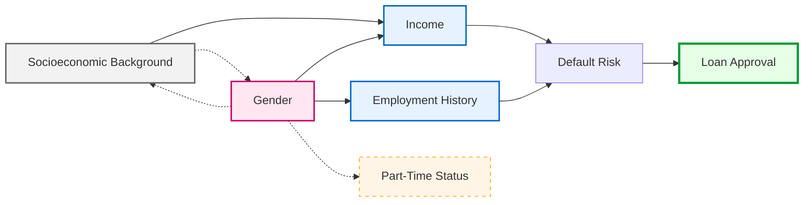
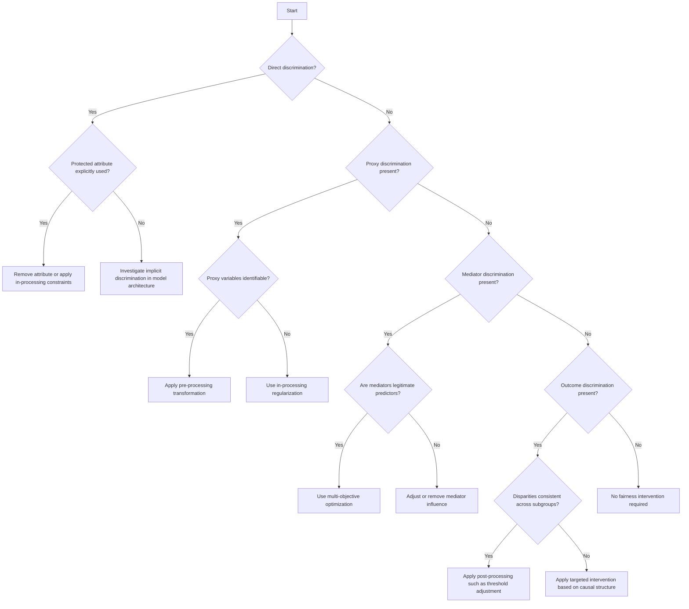

# Causal Fairness Toolkit
A Practical Framework for Identifying and Fixing Algorithmic Bias

## 1. Introduction

Machine learning systems sometimes produce different outcomes for different groups of people. But seeing a difference does not automatically tell us whether the system is unfair - or what is causing the difference.  

Disparities can happen for many reasons. A model might directly use a protected attribute _(like gender)_, rely on variables that indirectly reflect it _(such as job type or part-time status)_, reflect patterns from historical inequality, or use legitimate risk factors. Without understanding the real cause, fairness fixes may only treat the symptoms instead of solving the problem.  

The **Causal Fairness Toolkit provides a practical step-by-step method to help teams understand where unfairness comes from and how to address it properly**. It helps teams:   

- Map how protected attributes may influence predictions
- Check whether a decision would change **if only a protected attribute were different, while everything else stayed the same**.
- Separate legitimate prediction factors from discriminatory ones
- Choose the right place in the system to intervene
- Make thoughtful decisions even when information is incomplete

Instead of applying simple statistical adjustments, this toolkit focuses on understanding the reasons behind disparities so that interventions are more precise, transparent, and effective.  

### Why Causal Fairness Instead of Only Statistical Fairness?

Traditional fairness metrics (such as equal approval rates across groups) measure outcome differences, but they do not explain why those differences exist.  

Two systems can show the same statistical disparity:
- One due to legitimate risk differences
- One due to discriminatory mechanisms

Statistical fairness cannot distinguish between these cases.  

The Causal Fairness Toolkit focuses on identifying how protected attributes influence outcomes and whether those pathways are fair or unfair. This ensures interventions address root causes rather than masking disparities.  

## 2. Toolkit Overview 

The toolkit consists of four components:

1️⃣ **Causal Modeling Template**  
    1.1 Variable Identification  
    1.2 Causal Graph Construction  

2️⃣ **Counterfactual Analysis Framework**  
    2.1 Counterfactual Query Formulation  
    2.2 Path-Specific Effect Analysis  
    2.3 Counterfactual Evaluation Metrics  
    2.4 Intersectional Counterfactual Analysis  

3️⃣ **Intervention Point Identification Method**  
    Decision Tree  
    Governance Framework  

4️⃣ **Limited Information Adaptation**  
    Observational Methods  
    Multiple Models  
    Sensitivity Analysis  
    Intersectional Modeling  
    Documentation  

5️⃣ Domain Adaptation & Deployment Check   

6️⃣ Practical Workflow Summary   

7️⃣ Core Principles   

--- 
 

## 1️⃣ Causal Modeling Template  
→ Map how protected attributes influence predictions.

---

### 1.1 Variable Identification Guide

---

### A. Protected Attributes Identification
1. **Primary protected attributes:**  
[List legally protected characteristics relevant to this application]  
_[(e.g., gender, race, age)]_    
2. **Intersectional categories:**  
[List relevant combinations of protected attributes]  
 _[(e.g., gender × age)]_     

Document why each attribute is relevant in this context.  

***

### B. Mediator Variable Identification
Mediators are variables that are influenced by protected attributes and also influence the outcome.  
These variables may transmit structural inequalities.  
1. **Variables directly influenced by protected attributes:**  
[List variables]  
_[(e.g., employment history, income level)]_   
2. **Evidence for causal relationship:**    
[Provide brief justification for each variable - domain expertise, research findings, or data patterns]    
_[(e.g., research on wage gaps, observed career breaks)]_        

For each mediator, consider:  
- Does this variable reflect historical or structural inequality?
- Should its influence on the outcome be preserved or adjusted?

***

### C. Confounding Variable Identification
Confounders are variables that influence both protected attributes and outcomes, potentially creating misleading associations.  
1. **Variables that may affect both protected attributes and outcomes:**  
[List variables]  
_[(e.g., socioeconomic background, neighborhood economic conditions)]_  
2. **Evidence for confounding role:**  
[List evidences]  
_[(e.g., research linking socioeconomic status to both education and loan approval)]_  

For each potential confounder, consider:
- Does this variable create a spurious relationship?
- Is it measured in the data?
- Could omitting it bias fairness conclusions?

---

### D. Proxy Variable Identification
Proxy variables are correlated with protected attributes and may indirectly encode them.  
1. **Variables correlated with protected attributes:**  
[List variables]  
_[(e.g., part-time employment status, zip code)]_  
2. **Evidence for correlation:**  
[Brief justification per variable]  
_[(e.g., statistical correlation, labor market patterns)]_   
3. **Common causes explaining correlation:**   
[Explanation per variable]  
_[(e.g., occupational segregation, residential segregation)]_  

---

### E. Outcome Variable Identification
Define the system’s decision or prediction.  
1. **Decisions or predictions made by the system:**  
[List outcomes]  
_[(e.g., loan approval decision, risk score)]_  
2. **Evaluation metrics used:**  
[List metrics]  
_[(e.g., approval rate, default rate, accuracy)]_    

---

### F. Legitimate Predictor Identification  
Variables that should influence the outcome because they are directly related to the task.  

1. **Variables that should influence outcomes:**  
[List variables]  
_[(e.g., debt-to-income ratio, savings history, payment history)]_  
2. **Justification for legitimacy:**  
[Brief justification per variable]  
_[(e.g., directly measures repayment ability)]_  

Document justification for each variable.  

---

### 1.2 Causal Graph Construction

---

After identifying variables, construct a **Directed Acyclic Graph (DAG)** to visually represent how variables influence one another.  

- **Use directed arrows to represent causal relationships.**    
> _Example:_  
>   
> **Gender → Employment History → Default Risk → Loan Approval**   
> _(Gender may influence employment history, which affects default risk.)_  

- **Use bidirectional dashed arrows to represent correlations without direct causation.**   
   
> **Gender ↔ Part-Time Status**  
> _(Part-time work may correlate with gender, but gender does not directly “cause” part-time status in a strict biological sense - both may reflect broader social patterns.)_  

- **Distinguish node types visually:**
  - **Protected attributes:** _[e.g., Gender]_
  - **Mediators:** _[e.g., Income Level, Employment History]_
  - **Proxy variables:** _[e.g., Industry Sector]_
  - **Confounders:** _[e.g., Socioeconomic Background]_
  - **Outcomes:** _[e.g., Loan Approval Decision]_

- **Document causal assumptions with justification for each arrow.**  
> _Example justification:_  
>      
> - "Gender → Income" based on documented wage gap research.  
> - "Income → Default Risk" based on financial risk modeling evidence.  

- **Identify critical paths that may transmit discrimination.**  
> _Example critical paths:_  
>   
> - Gender → Income → Debt-to-Income Ratio → Approval  
> - Gender → Employment Gap → Risk Score → Approval  

These paths should later be evaluated through counterfactual analysis to determine whether they represent legitimate influence or discrimination.

---

### DAG Example 

**Legend:**  
> - Pink → Protected attributes  
> - Blue → Mediators  
> - Orange dashed border → Proxy variables  
> - Grey → Confounders  
> - Green → Outcomes  
>  
> Solid arrow (→) : Causal relationship  
> Dashed arrow (-.-→) : Correlation / proxy relationship  

---

## 2️⃣ Counterfactual Analysis Framework

→ Test whether predictions would change if only the protected attribute changed.  

---

### 2.1 Counterfactual Query Formulation  

---

### 1. **Base case description**   
Describe the **real individual and the model’s actual decision**.  
- **Individual characteristics:**  
[Relevant non-protected attributes]   
_Example: [Credit score: 720, Income: €45,000, Debt-to-income ratio: 28%, Savings: €12,000, 2-year employment gap]_
- **Protected attribute value:**  
[Current value]   
_[Gender: Female]_   
- **System prediction:**  
[Current prediction/decision]  
_[Loan Denied – predicted default risk: 18%]_  

---

### 2. **Counterfactual scenario:**  
Create the **“what if” version of the same person**.

- **Modified protected attribute:**  
[Counterfactual value]  
_[Gender: Male]_       
> Ask: If this exact same applicant were male instead of female, what would happen?  

- **Variables that should remain constant:**   
[List causally independent variables]  
  
> Characteristics that should not change just because gender changes (they are not caused by gender in our model):  
> - _[Credit score: 720]_   
> - _[Savings: €12,000]_  
> - _[Debt-to-income ratio: 28%]_  
>
> These stay fixed. 

- **Variables that should change:**  
[List descendants of protected attributes]  

> These are variables that could be influenced by gender in the real world (based on our causal model):  
> - _[Employment history interpretation]_
> - _[Income assessment weight]_
> - _[Income stability scoring]_  
>
>_Because our causal model shows gender can influence how employment gaps or income stability are evaluated._  

---

### 3. **Fairness evaluation:**
Compare the outcomes.  

- **Expected outcome under counterfactual:**  
[Prediction if fair]

> _Example:_
>   
> _If the model does not unfairly use gender, then:_  
> _The prediction should remain Loan Denied (18%)_   
> _or_  
> _The risk score should stay essentially the same._    

- **Actual model behavior:**  
[What model actually does]

> _When we simulate the counterfactual:_   
> - _Predicted default risk becomes 13%_     
> - _Loan decision becomes Approved_   

- **Discrepancy analysis:**  
[Compare expected vs. actual]   

  - Did prediction change?  
  - If yes → potential counterfactual unfairness

> _Example:_  
>   
> | Scenario                 | Predicted Risk | Decision |
> |--------------------------|---------------|----------|
> | Female (real case)       | 18%           | Denied   |
> | Male (counterfactual)    | 13%           | Approved |
>
> _This means:_
> - _The decision changes only because gender changed._  
> - _Therefore, the model is counterfactually unfair for this individual._  

---

### ! Important Limitation:  
### Counterfactuals Are Estimated
Counterfactual fairness cannot be directly observed from real-world data.  

> We never see the same person both:  
> - As they are
> - As they would have been with a different protected attribute.  

All counterfactual conclusions depend on the causal assumptions encoded in the model.  

Therefore:  
- **Causal assumptions must be documented.**
- **Sensitivity analysis must be performed.**
- **Results should be presented with uncertainty.**

---

### 2.2 Path-Specific Effect Analysis    

---

### 1. **Identify specific causal pathways** from protected attributes to outcomes  
Start by mapping all paths from the protected attribute _(e.g., gender)_ to the outcome _(e.g.,loan approval)_.  

> _Example paths in the loan system:_
>   
> **1. Gender → Employment History → Default Risk → Approval**  
> **2. Gender → Income Level → Debt-to-Income Ratio → Default Risk → Approval**  
> **3. Gender → Part-Time Status → Income Stability → Default Risk → Approval**  
> **4. Gender → Approval (direct path)**  
>  
> Each of these is a separate mechanism through which disparity may occur.  

---

### 2. **Classify paths** as legitimate or problematic based on domain knowledge.
This step requires **normative judgment** - not just technical analysis.  

You must decide:  
- Does this pathway reflect legitimate risk?
- Or does it reflect structural or historical bias?

> | Path                                                  | Possible Classification       | Why?                                                                 |
> |-------------------------------------------------------|------------------------------|----------------------------------------------------------------------|
> | Gender → Employment History → Default Risk            | ⚠ Potentially Problematic    | Career breaks may reflect caregiving responsibilities, not actual repayment ability |
> | Gender → Income → Debt Ratio → Default Risk           | ⚠ Partially Problematic      | Income differences may reflect systemic wage gaps                   |
> | Gender → Part-Time Status → Default Risk              | ❌ Problematic               | Part-time status may act as a gender proxy                          |
> | Gender → Approval (direct)                            | ❌ Clearly Unfair            | No legitimate reason for direct gender influence                    |
 
This step must involve:  
- Legal review
- Domain experts
- Business stakeholders

It cannot be decided by code alone.  

---

### 3. Quantify the contribution of each path to observed disparities.  
Measure how much each path contributes to the overall disparity.

> _Example findings:_
>   
> - _Employment history pathway → 40% of disparity_
> - _Income pathway → 25%_
> - _Part-time proxy pathway → 20%_
> - _Direct discrimination → 15%_

This tells you which mechanisms matter most.  
Without this step, you might overcorrect small effects and ignore major ones.  

---

### 4. Focus interventions on problematic paths while preserving legitimate paths.
The goal is **surgical intervention**, not destroying model performance.  

Instead of forcing demographic parity, you:  
- Remove or adjust problematic paths
- Preserve legitimate predictive information

> _Example Interventions_  
> | Problematic Path        | Intervention                                      |
> |-------------------------|---------------------------------------------------|
> | Employment gap penalty  | Replace with "total relevant experience"          |
> | Raw income weight       | Normalize income relative to loan size            |
> | Part-time status proxy  | Replace with direct income stability metric       |

---

## 2.3 Counterfactual Evaluation Metrics  

--- 
To move beyond individual examples, fairness should be measured systematically.  

### 1. Counterfactual Effect Size  
Average difference between factual and counterfactual predictions across individuals.  

> _Example:_  
> _Average risk score decreases by 4% when gender changes → indicates systematic influence._

### 2. Counterfactual Violation Rate  
Proportion of individuals whose decision changes under counterfactual modification.  

> _Example:_  
> _18% of applicants would receive a different approval decision if gender were changed._

### 3. Path-Specific Effect Magnitude  
Percentage of total disparity attributable to specific causal pathways.  

> _Example:_  
> _Employment pathway → 40%_  
> _Income pathway → 25%_  

### 4. Uncertainty Quantification
Use confidence intervals or bounding approaches to express uncertainty in effect estimates.  

Never report counterfactual fairness as absolute certainty.  

---

### 2.4 Intersectional Counterfactual Analysis

---

Discrimination may occur at intersections of protected attributes rather than along a single attribute.  

> _For example, an algorithm may treat:_   
> - _women fairly overall_    
> - _older applicants fairly overall_    
>  
>  _but still disadvantage **older women specifically**._      

To detect this, extend counterfactual queries to change **multiple protected attributes simultaneously**.

> _Example counterfactual question:_    
>     
> _Would this applicant’s decision change if they were:_  
> - _**Male instead of female**, AND_  
> - _**Younger instead of older**?_    

Key measures include:

- **Intersectional counterfactual violation rates**  
  Percentage of cases where predictions change for specific attribute combinations.

- **Path-specific effects for subgroup combinations**  
  Identifying whether certain causal pathways disproportionately affect intersectional groups.

When subgroup data is limited:  

- Use **hierarchical modeling** to borrow statistical strength from related groups.
- **Report higher uncertainty** in estimates for small intersectional populations.

---

## 3️⃣ Intervention Point Identification Method
The Intervention Point Identification Method helps teams decide where to make changes in the ML pipeline based on the results of the causal analysis. It connects different types of bias to the right kind of intervention.

---

### Causal Pattern Decision Tree

---

#### Intervention Selection Decision Tree

1. If **direct discrimination is present** (direct path from protected attribute to outcome):  
   a. Is the protected attribute explicitly used as a feature?
      - Yes → Apply in-processing constraints or remove the attribute
      - No → Investigate implicit direct discrimination through model architecture

2. If **proxy discrimination is present** (path through correlated but not causally related variables):  
   a. Can the proxy variables be identified?  
      - Yes → Consider pre-processing approaches to transform these variables
      - No → Apply in-processing regularization to minimize proxy use

3. If **mediator discrimination is present** (path through variables causally influenced by protected attributes):  
   a. Are the mediator variables legitimate predictors for the task?  
      - Yes → Consider using multi-objective optimization to balance fairness with prediction
      - No → Apply pre-processing to remove the influence of protected attributes on these variables

4. If **outcome discrimination is present** (disparities in model outputs):  
   a. Are the disparities consistent across subgroups?  
      - Yes → Consider post-processing approaches like threshold optimization
      - No → Apply more targeted interventions based on causal structure

---

---

### Governance & Stakeholder Review Framework

---

Classification of causal pathways as “fair” or “unfair” is a normative decision.  

Establish a structured review process:  
- Legal review (regulatory compliance)
- Domain expert validation
- Business stakeholder alignment
- Documentation of disagreements

Maintain:  
- Written justification for pathway classification
- Record of trade-offs between fairness and performance
- Version-controlled fairness decisions  

Fairness governance is as important as technical implementation.  

---

## 4️⃣ Limited Information Adaptation

In real-world applications, we rarely know the full causal structure behind the data, and it is usually impossible or unethical to run experiments that change protected attributes such as gender or race.

To address these challenges, the toolkit recommends the following approaches:  

### 1. Method Selection for Observational Causal Inference  
When experimental manipulation is impossible, causal effects must be estimated from observational data.  

Choose methods based on available data and assumptions:  

| Scenario | Recommended Method | Key Assumption |
|--------|--------|--------|
| Rich covariate data | Matching / Propensity Score | All confounders measured |
| External variable affects protected attribute only | Instrumental Variables | Valid instrument exists |
| Clear policy threshold | Regression Discontinuity | Individuals near threshold comparable |
| Policy change over time | Difference-in-Differences | Parallel trends assumption |

Whenever possible, apply multiple methods and compare results to check robustness.

---

### 2. Test Multiple Plausible Models
Test fairness under different causal assumptions when causal structure is uncertain.

---

### 3. Sensitivity Analysis
Perform sensitivity analysis to identify robust intervention decisions.

- How strong must hidden confounding be to eliminate the observed effect?
- Use E-values or bounding methods.

---

### 4. Intersectional Modeling
Prioritize resolving uncertainties that would change intervention recommendations.

- Use hierarchical models when subgroup data is sparse.
- Quantify uncertainty explicitly.

---

### 5. Transparent Documentation
Document assumptions explicitly to enable future refinement.

Always document:
- Assumptions
- Uncertainties
- Rationale for intervention choices

 

## 4. Domain Adaptation & Deployment Check

Causal fairness guarantees may not transfer automatically across contexts.  

Before deployment:  
- Does the causal structure hold in the new environment?
- Are socioeconomic relationships different?
- Do protected attribute effects vary across regions or time?

If deploying across domains:  
- Re-validate key causal assumptions.
- Re-run counterfactual evaluation.
- Monitor fairness continuously post-deployment.

Fairness is not a one-time certification. It requires ongoing validation.

---

## 5. Practical Workflow Summary

1. Identify variables
2. Build causal graph
3. Run counterfactual queries
4. Decompose pathways
5. Select targeted interventions
6. Quantify uncertainty
7. Re-evaluate after intervention

---

## 6. Core Principle

Fairness interventions should:

- Address root causal mechanisms
- Preserve legitimate predictive information
- Explicitly document causal assumptions
- Quantify uncertainty
- Consider intersectional effects
- Remain robust across deployment contexts
- Involve stakeholder governance

