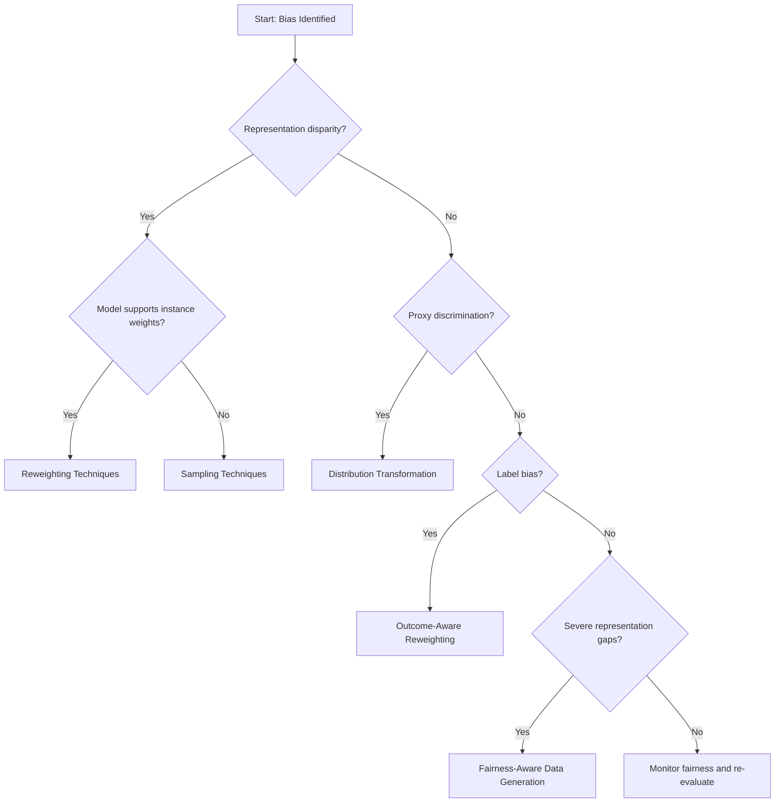

# Pre-Processing Fairness Toolkit
A Practical Framework for Selecting Data-Level Fairness Interventions

## Introduction

Machine learning systems can inherit bias from the data used to train them. Even when protected attributes such as gender or race are not explicitly included in a model, historical inequalities, representation imbalances, and proxy variables may still produce discriminatory outcomes.

Bias in training data can arise through several structural mechanisms, including:

- **Representation disparities** where certain demographic groups are underrepresented
- **Proxy discrimination** where seemingly neutral variables indirectly encode protected attributes
- **Label bias** where historical decisions reflect discriminatory practices
- **Feature–attribute correlations** where predictive variables systematically differ across groups  

If these issues are not addressed before training, machine learning models may reproduce and amplify existing inequalities.

The **Pre-Processing Fairness Toolkit** provides a structured framework for diagnosing and mitigating bias at the data level before model training begins.

The toolkit helps teams:

- Identify bias patterns through systematic data auditing  
- Select appropriate pre-processing techniques based on bias mechanisms  
- Configure interventions for specific fairness goals  
- Evaluate fairness improvements while preserving predictive performance  
- Document fairness decisions transparently  

Rather than applying fairness interventions blindly, the toolkit focuses on **matching specific bias patterns to appropriate data-level interventions**.

---

## Relationship to the Causal Fairness Toolkit

The **Pre-Processing Fairness Toolkit** is designed to work in conjunction with the **[Causal Fairness Toolkit](https://github.com/monikase/AI_Ethics/blob/main/Fairness_Intervention_Playbook/1_CAUS.md)**.

While the Causal Fairness Toolkit focuses on identifying **why disparities occur** by analyzing causal pathways between protected attributes and outcomes, the Pre-Processing Toolkit focuses on **how to intervene at the data level to mitigate those disparities**.

Together, the two toolkits form a complementary workflow:

| Stage | Toolkit | Purpose |
|------|--------|--------|
| Bias Diagnosis | Causal Fairness Toolkit | Identify causal mechanisms behind disparities |
| Data Intervention | **Pre-Processing Fairness Toolkit** | Mitigate bias in training datasets |
| Model Intervention | In-Processing Fairness Toolkit | Integrate fairness constraints during training |
| Prediction Intervention | Post-Processing Fairness Toolkit | Adjust model outputs after training |

> ### Example Integration  
>  
> For example, causal analysis may reveal the pathway:   
> Gender → Employment History → Default Risk → Loan Approval    
>  
> This suggests that **employment history acts as a mediator influenced by gender**, potentially penalizing applicants with career breaks.  
>  
> The Pre-Processing Toolkit then translates this insight into a **specific intervention**, such as:  
>  
>  - transforming employment history into a **relevant experience metric**  
>  - reweighting samples with employment gaps  
>  - generating counterfactual examples that remove gender-based employment penalties  

By linking causal diagnosis with targeted data-level interventions, the combined toolkit enables teams to address fairness issues **at their root cause rather than through purely statistical adjustments**.  

---

## Toolkit Overview

The toolkit consists of the following components:

### 1️⃣ [Comprehensive Data Auditing Framework](#auditing)
- 1.1 Initial Data Profiling and Documentation
- 1.2 Representation Analysis  
- 1.3 Correlation and Proxy Detection  
- 1.4 Label Quality Assessment  
- 1.5 Fairness Baseline Calculation   

### 2️⃣ [Technique Catalog](#catalog)
- 2.1 Reweighting Techniques  
- 2.2 Sampling Methods  
- 2.3 Distribution Transformation Methods  
- 2.4 Fairness-Aware Data Generation  

### 3️⃣ [Intervention Selection Framework](#selection)  

### 4️⃣ [Configuration Guidelines](#configuration)
- 4.1 Reweighting Configuration  
- 4.2 Transformation Configuration  
- 4.3 Synthetic Data Generation Configuration  
- 4.4 Fairness–Utility Trade-off Management  

### 5️⃣ [Evaluation Framework](#evaluation)
- 5.1 Fairness Metrics  
- 5.2 Information Preservation  
- 5.3 Computational Efficiency  
- 5.4 Robustness and Stability  

### 6. [Deployment & Monitoring](#deployment)

### 7. [Implementation Checklist](#checklist)

### 8. [Practical Workflow Summary](#summary)

### 9. [Core Principles](#core-prin)

---

## 1️⃣ Comprehensive Data Auditing Framework
→ Diagnose bias patterns before selecting fairness interventions.  

---

### 1.1 Initial Data Profiling and Documentation

Document how the dataset was created and what limitations it may contain.  

#### 1. Document data sources and collection methods

Identify how the data was gathered and whether sampling methods may introduce bias.

> Example considerations:  
>   
> - Were certain populations more likely to be included in the dataset?
> - Were there barriers preventing some groups from being represented?  

#### 2. Establish reference populations

Define the population that the dataset is intended to represent.

> Possible references include:  
> - National census data
> - Domain-specific benchmarks
> - Historical population distributions

#### 3. Identify protected attributes and potential proxy variables

List protected attributes relevant to the application context.

> Examples may include:  
> - gender
> - race or ethnicity
> - age
> - disability status 

#### 4. Create a data dictionary

Document key properties of the dataset, including:  
- Feature definitions
- Data sources
- Measurement units
- Known limitations or missing values

---

### 1.2 Multidimensional Representation Analysis

Examines whether demographic groups are adequately represented in the dataset.

#### 1. Compare dataset demographics with reference populations 
Check whether the dataset reflects the population relevant to the application.  

The reference population should match the **decision context**, not necessarily the general population.  

Possible reference sources include:  
- Census statistics
- Industry benchmarks
- Application-specific populations _(e.g., loan applicants)_

> _Example (Loan Applications):_
>
> | Group | Applicant Population | Training Dataset |
> |------|----------------------|------------------|
> | Women | 46% | 28% |
> | Men | 54% | 72% |
>
> _Women appear substantially underrepresented in the training data compared to the applicant population. This may cause the model to learn patterns that favor male applicants._

#### 2. Identify representation gaps  
Compare dataset demographics to reference populations to identify representation gaps across both individual attributes and their intersections.

> _Example:_
>
> | Group | Dataset Share | Expected Share |
> |------|---------------|---------------|
> | Women | 48% | 50% |
> | Women of color | 9% | 14% |
>
> _Although overall representation of women appears close to expected levels, intersectional analysis reveals that **women of color are significantly underrepresented**._

#### 3. Analyze representation across outcomes
Examine whether different groups appear equally across outcome labels.

> _Example:_
>  
> | Group | Loan Approval Rate |
> |------|--------------------|
> | Male applicants | 76% |
> | Female applicants | 58% |
>
> _This disparity may indicate potential bias in historical decision outcomes._

#### 4. Temporal analysis

Check whether demographic representation changes over time.

> _Example:_
>
> | Year | Women in Dataset |
> |------|------------------|
> | 2018 | 30% |
> | 2021 | 40% |
> | 2024 | 52% |
>
> _Sudden changes may indicate shifts in data collection practices or market participation._

#### 5. Visualize demographic distributions  

Common visualization techniques include:

- **Bar charts**  
  Used to compare representation across demographic groups.  
  _(e.g., gender distribution of loan applicants)_
- **Stacked bar charts**  
  Used to compare outcome distributions across groups.
  _(e.g., loan approval vs rejection rates by gender)_
- **Mosaic plots**    
  Used to visualize intersectional representation across multiple attributes.  
   _(e.g., gender × race representation among applicants)_
- **Heatmaps**  
  Used to visualize representation across multiple group combinations.  
   _(e.g., representation across gender × age groups)_
- **Time series plots**  
  Used to detect representation shifts across time periods.  
  _(e.g., percentage of female applicants across years)_

---

### 1.3 Correlation and Proxy Detection

#### 1. Calculate correlation coefficients between protected attributes and other features in the dataset

This helps identify variables that may encode protected attributes indirectly.

> _Example:_  
>  
> | Feature | Correlation with Gender |
> |--------|------------------------|
> | Part-time employment | 0.47 |
> | Industry sector | 0.31 |
> | Years of continuous employment | -0.28 |
>
> _These correlations suggest that part-time status and employment history may act as proxies for gender._

Correlation analysis works well for **linear relationships**, but may miss more complex patterns.

#### 2. Mutual information analysis

Mutual information measures how much information one variable provides about another, capturing **both linear and non-linear relationships**.

> _Example:_  
>
> A mutual information score shows that:
>
> | Feature | Mutual Information with Gender |
> |--------|-------------------------------|
> | Language style in resumes | 0.42 |
> | Job industry | 0.25 |
>
> _This indicates that language patterns in resumes may indirectly encode gender information._

#### 3. Conditional independence testing

Conditional independence tests examine whether a relationship between two variables persists **after controlling for other relevant variables**.

This helps distinguish **legitimate relationships from proxy discrimination**.

> _Example:_  
>
> Suppose ZIP code is correlated with race.  
> After controlling for **income level**, the correlation remains strong.
>
> _This suggests ZIP code may still act as a proxy for race beyond legitimate economic differences._

#### 4. Correlation network visualization

Visualization can reveal complex relationships between protected attributes and multiple features simultaneously.

Common visualization approaches include:

- **Correlation heatmaps** showing strength of relationships between variables  
- **Network graphs** highlighting features strongly associated with protected attributes  

---

### 1.4 Label Quality Assessment

#### 1. Analyze historical sources of labels

Understand how the labels were generated and whether they may reflect biased human decisions or institutional practices.

Questions to investigate:

- Who created the labels?
- What rules or criteria were used?
- Were these decisions historically subject to discrimination?

> _Example_
>
> _In a loan dataset, the label *“loan approved”* may reflect historical approval decisions made by bank officers._  
> _If those decisions were influenced by gender bias, the labels themselves may encode discrimination._

#### 2. Compare label distributions across demographic groups and intersections

Check whether outcomes differ significantly across protected attributes or intersectional groups.  

> _Example_
>
> | Group | Approval Rate |
> |------|---------------|
> | Men | 76% |
> | Women | 58% |
>
> _If applicants have similar financial characteristics but approval rates differ significantly, this may indicate **label bias**._

Intersectional comparisons may reveal additional patterns:

> _Example_
>
> | Group | Approval Rate |
> |------|---------------|
> | Men | 76% |
> | Women | 58% |
> | Women over 45 | 51% |
>
> _This suggests that disparities may exist **not only by gender but also by intersectional subgroups**._

#### 3. Validate labels against external benchmarks when possible
Compare labels with independent sources of information that better reflect the true outcome of interest.  

Possible validation approaches include:  
- Comparing labels with **objective outcome data** when available  
- Reviewing a subset of labeled cases with **domain experts or independent evaluators**  
- Comparing outcomes with **external datasets or industry benchmarks**  
- Checking consistency of labels across **different time periods or decision-makers**

> _Example_
>
> Rejected loan applicants may later demonstrate similar performance or outcomes as accepted applicants, suggesting the original decision labels may not fully reflect true capability or risk.

#### 4. Document known label limitations

All identified label quality issues should be explicitly documented to inform later fairness interventions.

Documentation should include:

- Known sources of historical bias
- Data collection limitations
- Measurement errors
- Differences between labels and true outcomes

---

### 1.5 Fairness Baseline Calculation

#### 1. Select relevant fairness metrics

Multiple metrics should be evaluated to capture different aspects of fairness.  

Common fairness metrics include:

- **Demographic parity** – whether positive outcomes occur at similar rates across groups
- **Equal opportunity** – whether true positive rates are similar across groups
- **Equalized odds** – whether both true positive and false positive rates are similar
- **Predictive parity** – whether predictions are equally reliable across groups

> _Example_
>
> A model recommends candidates for interview.  
> The demographic parity metric compares the **percentage of candidates recommended for interview** across groups.
>
> | Group | Interview Recommendation Rate |
> |------|-------------------------------|
> | Men | 64% |
> | Women | 49% |

#### 2. Calculate metrics across demographic groups and intersections

Fairness metrics should be calculated not only for single protected attributes but also for **intersectional groups**.

This helps detect disparities that may only appear when multiple attributes are combined.

> _Example_
>
> | Group | Positive Outcome Rate |
> |------|-----------------------|
> | Men | 64% |
> | Women | 49% |
> | Women over 45 | 42% |
>
> Although women overall have lower rates, the disparity is **even larger for older women**, highlighting an intersectional fairness issue.

#### 3. Apply statistical significance testing

Observed disparities may occur due to random variation in the data.  
Statistical tests help determine whether differences between groups are **statistically meaningful**.

Common approaches include:

- Hypothesis testing for group differences
- Confidence interval comparisons
- Bootstrap estimation of fairness metrics

> _Example_
>
> Suppose the recommendation rate difference between men (64%) and women (49%) is tested.
>
> A statistical test shows:
>
> - Difference: **15 percentage points**
> - p-value: **0.004**
>
> Since the difference is statistically significant, it likely reflects a systematic disparity rather than random noise.

#### 4. Visualize fairness gaps

Visualization helps communicate disparities clearly and identify patterns that may not be obvious in tables.

Common visualization approaches include:

- **Bar charts** comparing outcome rates across groups
- **Group fairness dashboards** showing multiple fairness metrics
- **Heatmaps** highlighting disparities across intersectional groups
- **Time series charts** tracking fairness metrics over time

---

## 2️⃣ Technique Catalog
→ Available data-level fairness interventions.

---

### 2.1 Reweighting Techniques

- Reweighting techniques adjust the **influence of training instances** during model training without changing the data itself.  
- They assign **weights to examples** so underrepresented groups or outcomes have proper influence on the learning process.  
- These methods help address fairness issues caused by **representation imbalance or biased outcomes** in the dataset.  

---

### A. Instance Weighting

 **Description:**  
Instance weighting assigns different importance weights to training examples based on their demographic group representation.  
Underrepresented groups receive **higher weights**, ensuring that the model pays sufficient attention to their patterns during training.  

**Use cases:**  
- Correcting demographic representation imbalances
- Improving representation of minority groups in training data
- Situations where models support sample weighting  

**Strengths:**  
- Keeps all original data points
- Provides flexible adjustment of intervention strength
- Easy to integrate with many machine learning frameworks  

**Limitations:**  
- Not all algorithms support instance weights
- Large weights may increase variance and risk of overfitting  

---

### B. Outcome-Aware Reweighting

 **Description:**  
Outcome-aware reweighting assigns weights based on **protected attribute–outcome combinations**.   
This approach increases the influence of examples that contradict historical bias patterns.  

**Use cases:**  
- Addressing historical label bias
- Improving fairness in decision outcomes
- Situations where some groups systematically receive fewer positive outcomes

**Strengths:**  
- Targets biased outcome distributions directly
- Encourages models to learn fairer decision boundaries
- Works well when label bias is suspected

**Limitations:**  
- Requires careful design of weighting formulas
- Extreme weights may destabilize training

> _Example_
>
> _Suppose historical loan approvals show:_
>
> | Group | Approval Rate |
> |------|---------------|
> | Men | 76% |
> | Women | 58% |
>
> Outcome-aware reweighting increases weights for **approved female applicants** and **rejected male applicants**, helping the model learn less biased patterns.

---

### C. Conditional Reweighting

**Description:**  
Conditional reweighting adjusts weights to equalize outcomes **within comparable groups of feature values**.  
This approach ensures that individuals with similar characteristics receive similar influence during model training regardless of their protected attributes.  

**Use cases:**  
- Situations where fairness should hold **conditional on legitimate predictors**
- Applications requiring fairness within comparable risk groups
- Models where simple demographic balancing is insufficient

**Strengths:**  
- Preserves legitimate predictive relationships
- Provides more nuanced fairness adjustments
- Reduces risk of oversimplified demographic balancing

**Limitations:**  
- Requires defining appropriate conditioning variables
- More complex to implement than basic weighting

> _Example_
>
> In a credit scoring dataset, applicants with similar financial profiles may receive different historical decisions depending on gender.
>
> Conditional reweighting adjusts instance weights so that **applicants with similar credit profiles influence the model equally**, regardless of demographic group.

---

### 2.2 Sampling Methods

- Sampling techniques **modify the training dataset composition** by changing how often instances appear during training.
- Instead of assigning weights, they **duplicate or remove examples** to create a more balanced dataset.
- These methods are useful when there are **large representation imbalances**, when models **do not support instance weights**, or when fairness adjustments are applied directly during data preparation.

---

### A. Oversampling

**Description:**  
Oversampling increases the number of examples from **underrepresented groups** by **duplicating existing instances or generating synthetic ones**.  
This ensures that minority groups appear more frequently during model training.

**Use cases:**  
- Addressing demographic underrepresentation
- Improving model learning for minority groups
- Situations where minority classes contain too few samples

**Strengths:**  
- Improves representation of minority groups
- Easy to implement
- Compatible with most machine learning models

**Limitations:**  
- May increase risk of overfitting when examples are duplicated
- Does not address deeper structural biases in features

> _Example_
>
> _Suppose a training dataset contains:_
>
> | Group | Dataset Share |
> |------|---------------|
> | Men | 80% |
> | Women | 20% |
>
> Oversampling duplicates examples from women until both groups have similar representation in the training dataset.

---

### B. Undersampling

 **Description:**  
Undersampling reduces the number of examples from **overrepresented groups** in order to balance the dataset.   
This approach **removes some majority group instances** so that minority groups have greater relative influence during training.  

**Use cases:**  
- Datasets with extreme representation imbalances
- Situations where majority group data is very large
- Models sensitive to class imbalance

**Strengths:**  
- Simple and computationally efficient
- Reduces dataset size and training time
- Helps balance group influence during training

**Limitations:**  
- Discards potentially useful data
- May reduce model performance if too many examples are removed

> _Example_
>
> _Suppose a hiring dataset contains:_
>
> | Group | Dataset Share |
> |------|---------------|
> | Men | 85% |
> | Women | 15% |
>
> Undersampling removes a portion of male applicant records so that the dataset contains a more balanced gender distribution.

---

### C. Synthetic Minority Sampling (SMOTE)

 **Description:**  
Synthetic Minority Over-sampling Technique (SMOTE) generates **new synthetic examples** for underrepresented groups by interpolating between existing samples.   
Rather than duplicating instances, SMOTE creates **new plausible data points** to improve minority group representation.  

**Use cases:**  
- Situations where minority groups have extremely limited data
- Datasets where simple duplication may cause overfitting
- Applications requiring richer representation of minority patterns

**Strengths:**  
- Reduces overfitting compared to simple duplication
- Creates more diverse examples for minority groups
- Improves model generalization for underrepresented populations

**Limitations:**  
- Synthetic samples may not perfectly reflect real-world distributions
- Requires careful validation to avoid unrealistic feature combinations

> _Example_
>
> In a medical diagnosis dataset, only a small number of patients from a particular demographic group may be present.
>
> SMOTE generates synthetic patient records based on existing examples, helping the model learn patterns relevant to that group without duplicating the same cases.

---

### 2.3 Distribution Transformation Methods

- Distribution transformation techniques modify the **feature space of the dataset** in order to reduce correlations between protected attributes and other variables.    
- These methods **change feature values or representations** to prevent models from learning discriminatory patterns.  
- They are especially useful when fairness issues come from **proxy discrimination**, where some features indirectly reveal protected attributes.  

---

### A. Disparate Impact Removal

**Description:**  
Disparate impact removal transforms feature distributions so that they become **independent of protected attributes** while preserving their relative ordering within groups.  
This method adjusts feature values across demographic groups so that the same feature has similar distributions regardless of protected attribute values.  

**Use cases:**  
- Situations where specific features act as proxies for protected attributes
- Continuous variables with different distributions across groups
- Applications where preserving feature ordering is important

**Strengths:**  
- Reduces proxy discrimination without removing useful features
- Preserves rank ordering within groups
- Adjustable transformation intensity

**Limitations:**  
- May reduce predictive power if important correlations are removed
- Requires careful parameter tuning
- More complex to implement for high-dimensional datasets

> _Example_
>
> In a loan dataset, **distance from financial centers** may correlate strongly with race due to residential segregation.
>
> Disparate impact removal transforms this feature so that its distribution becomes similar across racial groups while preserving relative differences within each group.

---

### B. Optimal Transport Transformation

**Description:**  
Optimal transport methods transform feature distributions by finding the **minimal adjustment needed to align distributions across groups** while preserving as much information as possible.  
This approach formulates distribution transformation as an optimization problem that minimizes the “transport cost” between original and transformed distributions.  

**Use cases:**  
- Complex datasets with multiple correlated features
- Situations where minimal information loss is critical
- Applications requiring mathematically principled transformations

**Strengths:**  
- Preserves predictive information more effectively than simple transformations
- Handles multidimensional feature relationships
- Provides mathematically grounded fairness adjustments

**Limitations:**  
- Computationally intensive for large datasets
- More complex to implement than simpler transformation methods
- Requires specialized optimization techniques

> _Example_
>
> In a hiring dataset, features such as **education background and work experience** may jointly correlate with gender.
>
> Optimal transport adjusts these feature distributions across genders while preserving their relationships with job performance indicators.

---

### C. Fair Representation Learning

**Description:**  
Fair representation learning transforms the original dataset into a **new feature space** where protected attributes cannot be easily inferred, while preserving information relevant for prediction.  
This approach learns representations that balance **fairness objectives and predictive performance**.  

**Use cases:**  
- High-dimensional datasets
- Complex feature interactions
- Applications involving text, images, or large feature sets

**Strengths:**  
- Handles complex non-linear relationships
- Provides strong fairness guarantees in the representation space
- Can address multiple bias mechanisms simultaneously

**Limitations:**  
- Reduced interpretability compared to original features
- Requires careful tuning of fairness–utility trade-offs
- Computationally more demanding

> _Example_
>
> In a job recommendation system, text features extracted from candidate profiles may encode gendered language patterns.
>
> Fair representation learning creates a transformed feature space where the model cannot reliably infer gender while still preserving information relevant to job matching.

---

### 2.4 Fairness-Aware Data Generation

- Fairness-aware data generation techniques create **new synthetic training examples** to reduce bias in the original dataset.   
- They **generate new samples** to improve representation and reduce discriminatory patterns.  
- These techniques are useful when there are **large representation gaps, complex correlations, or privacy limits** on using real data.

---

### A. Synthetic Data Augmentation

**Description:**  
Synthetic data augmentation generates additional examples for **underrepresented groups** to improve dataset balance.  
These new samples are created using statistical methods or interpolation techniques based on existing data.  

**Use cases:**  
- Severe underrepresentation of certain demographic groups  
- Datasets with very small minority group samples  
- Situations where collecting additional real-world data is difficult

**Strengths:**  
- Improves representation of minority groups  
- Helps models learn patterns for previously underrepresented populations  
- Can significantly reduce representation disparities

**Limitations:**  
- Synthetic samples may not perfectly reflect real-world distributions  
- Poorly generated data may introduce unrealistic patterns

> _Example_
>
> In a healthcare dataset, only a small number of patients from a particular demographic group may be represented.  
> Synthetic augmentation generates additional patient records with similar characteristics, helping the model learn patterns relevant to that group.

---

### B. Conditional Data Generation

**Description:**  
Conditional generation methods create synthetic data **conditioned on protected attributes or demographic groups**.  
This allows developers to explicitly control the demographic composition of the generated dataset.

**Use cases:**  
- Ensuring balanced representation across demographic groups  
- Creating datasets with specified demographic proportions  
- Situations requiring controlled fairness constraints

**Strengths:**  
- Provides precise control over demographic distributions  
- Can enforce group fairness constraints directly in the dataset  
- Helps balance representation across multiple attributes

**Limitations:**  
- Requires careful specification of generation conditions  
- Generated samples must be validated to ensure realism

> _Example_
>
> In a hiring dataset, conditional generation can create additional candidates across gender and racial groups while maintaining similar qualification distributio

---

### C. Counterfactual Data Augmentation

**Description:**  
Counterfactual augmentation generates alternative versions of existing data points by **modifying protected attributes while keeping other relevant features constant**.  
This helps models learn that predictions should remain stable when protected attributes change.

**Use cases:**  
- Addressing discrimination caused by protected attributes  
- Situations where causal relationships between variables are known  
- Applications requiring counterfactual fairness analysis

**Strengths:**  
- Directly targets causal pathways of discrimination  
- Encourages models to ignore protected attributes in decision making  
- Helps enforce counterfactual fairness

**Limitations:**  
- Requires strong assumptions about causal relationships  
- Generating realistic counterfactual examples can be challenging

> _Example_
>
> In a resume screening dataset, counterfactual augmentation may create multiple versions of the same candidate profile where only the gendered name is changed.  
> This encourages the model to make consistent predictions regardless of gender.

---

## 3️⃣ Intervention Selection Framework
→ Match bias patterns to appropriate interventions.

---

### Overview

---

### Step 1: Bias Pattern Identification

Use the results of the **data auditing process** to determine which bias pattern is present.  
The identified pattern determines which intervention path should be followed in the selection framework.  

Common patterns include:

| Bias Pattern | Description | Step to take |
|---|---|:---:|
| **Representation disparities** | Unequal group representation | [Step 2](#repdisparities) |
| **Proxy discrimination** | Correlations between features and protected attributes | [Step 3](#prodiscrimination) |
| **Label bias** | Historical discrimination in outcome labels | [Step 4](#labelbias) |
| **Multiple bias mechanisms** | Several bias sources interact | [Step 5](#combined) |
| **Intersectional representation gaps** | Very small subgroup sample sizes | [Step 6](#intersectional) |

---

### Step 2: Representation Disparities

If bias arises from **unequal representation of groups**, the next step is to determine how the dataset can be adjusted.  
- Does the model support instance weights?  
    - **Yes → Reweighting techniques**
         
    - **No → Evaluate the dataset composition**  
        - Does the dataset contain enough samples from underrepresented groups to rebalance the data?  
            - **Yes → Resampling techniques** (over/under-sampling)  
            - **No → Fairness-aware data generation**   

Synthetic data generation may also be necessary when intersectional groups are missing or extremely rare, making traditional sampling ineffective.

---

### Step 3: Proxy Discrimination

If bias arises because features act as proxies for sensitive attributes, the goal is to reduce the dependency between sensitive attributes and other variables.

- Can the proxy features be clearly identified?
    - **Yes → Evaluate interpretability requirements**
        - Interpretability is crucial → Disparate Impact Removal
        - Interpretability is less critical → Fair Representations
  
    - **No → Fair Representations or adversarial approaches**  

These methods transform feature representations so that **sensitive attributes cannot be easily inferred from the data.**

---

### Step 4: Label Bias

If the bias originates from systematically biased labels, the problem lies in the target variable rather than the feature distribution.

- Is the bias caused by historical discrimination or biased decision processes?
    - **Yes → Label correction techniques (transformation-based approaches)**  
      Methods such as label adjustment or massaging modify the dataset so that historically disadvantaged groups are not systematically penalized.
        
    - **No → Reconsider data collection or labeling processes**

In some cases, algorithmic preprocessing cannot fully address label bias, and improvements must be made at the **data collection or annotation stage**.

---

### Step 5: Combined Intervention Strategies

Many datasets contain multiple bias mechanisms, meaning that a single intervention may not be sufficient.

Example combined strategy:

| Bias Type | Intervention |
|---|---|
| Representation imbalance | Reweighting |
| Proxy discrimination | Feature transformation |
| Severe data gaps | Synthetic data generation |

---

### Step 6: Intersectional Intervention Considerations

Small **intersectional subgroups** may require specialized approaches because traditional balancing methods often fail when sample sizes are extremely small.  

Possible strategies include:  

- **Targeted oversampling** of minority subgroup combinations
- **fairness-aware synthetic data generation**
- **hierarchical or structured modeling approaches**

---

## 4️⃣ Configuration Guidelines
→ Configure fairness interventions for specific datasets.  

After selecting an appropriate intervention using the Intervention Selection Framework, the next step is to **configure the technique for the specific dataset and fairness objective**.  

Configuration involves selecting parameters that determine:  
- the **strength of the fairness intervention**
- the **features or groups affected**
- the **balance between fairness improvement and predictive performance**  

The following guidelines provide recommended procedures for tuning the main intervention categories.

---

### 4.1 Reweighting Configuration

---

**1. Select weighting scheme based on fairness goal:**  

Select the fairness goal guiding the weighting strategy.  

| Fairness Goal | Recommended Weighting Scheme |
|---|---|
| Demographic parity | Inverse frequency weighting |
| Equal opportunity | Conditional inverse frequency weighting |
| Balanced representation | Group-level weighting |

**2. Set intervention strength**

Large weights can destabilize model training.  
Start with moderate adjustments and increase gradually if fairness improvements are insufficient.  

Recommended approach:

- Start with **square-root inverse frequency weighting**
- Gradually increase weight differences if fairness gaps remain
- Apply **maximum weight caps** to prevent extreme influence

**3. Validate results**

Evaluate the impact of weighting on validation data.  

Check for:  

- improvement in fairness metrics across groups
- stable training behavior
- no overfitting of minority groups
- acceptable predictive performance

---

### 4.2 Transformation Configuration

---

**1. Select features to transform**

Identify features that show strong relationships with protected attributes.

Focus on variables with:

- high correlation with protected attributes
- strong mutual information scores
- significant model feature importance

Avoid transforming features that represent **legitimate task-relevant information**.

**2. Set transformation intensity**

Most transformation techniques allow controlling the degree of fairness adjustment.

Example for Disparate Impact Removal:

- **Repair level = 0** → no transformation  
- **Repair level = 1** → full removal of group differences  

Recommended approach:

- Begin with **partial repair (≈0.5)**
- Adjust based on fairness–utility trade-offs
- Preserve rank ordering within groups when necessary

**3. Validate results**

Evaluate whether the transformation achieved the intended effect.

Check for:

- reduced correlation with protected attributes
- preservation of predictive performance
- improved fairness metrics on validation data

---

### 4.3 Synthetic Data Generation Configuration

---

**1. Define fairness constraints**

Determine the demographic composition the dataset should achieve.

Possible goals include:

- balanced representation across groups
- improved representation of intersectional subgroups
- controlled demographic proportions

**2. Generate synthetic samples**

Train the generative model using the original dataset.

Important considerations:

- preserve realistic feature relationships
- avoid implausible feature combinations
- maintain consistency with domain knowledge

**3. Validate generated data**

Before integrating synthetic data into the dataset, verify that it is realistic and useful.

Check for:

- plausible feature distributions
- consistency with original data patterns
- improvement in representation across demographic groups

Typical dataset composition:

- **70–90% original data**
- **10–30% synthetic data** 

---

### 4.4 Fairness–Utility Trade-off Management

---

**1. Evaluate fairness and performance together**

Measure both fairness metrics and predictive performance during validation.

Common metrics include:

- demographic parity
- equal opportunity
- accuracy
- AUC or F1 score

**2. Adjust intervention strength gradually**

Increase fairness intervention intensity step by step.

Monitor changes in:

- fairness metrics
- predictive performance
- model stability

**3. Document trade-offs**

Record configuration decisions and their observed effects.

Documentation should include:

- chosen intervention parameters
- fairness improvements achieved
- performance changes observed

---

## 5️⃣ Evaluation Framework
→ Measure fairness intervention impact.

---

### 5.1 Fairness Metrics

Evaluate fairness using:

- demographic parity
- equal opportunity
- equalized odds

Metrics should be evaluated across:

- demographic groups
- intersectional subgroups

### 5.2 Information Preservation

Measure predictive performance:

- accuracy
- AUC
- F1 score

Ensure fairness improvements do not excessively reduce model performance.

### 5.3 Computational Efficiency

Assess:

- preprocessing runtime
- memory usage
- training time

### 5.4 Robustness and Stability

Test interventions under:

- different training splits
- parameter variations
- new incoming data

---

## 6. Deployment & Monitoring

Fairness interventions must remain effective after deployment.

Monitoring should include:

- periodic fairness audits
- detection of data distribution shifts
- retraining pipelines when disparities reappear

---

## 7. Implementation Checklist

Before deploying fairness interventions:

**Data Auditing**

- [ ] Representation analysis performed  
- [ ] Proxy variables identified  
- [ ] Label bias evaluated  

**Intervention Selection**

- [ ] Bias patterns classified  
- [ ] Appropriate technique selected  

**Configuration**

- [ ] Parameters tuned  
- [ ] Fairness–utility trade-offs documented  

**Evaluation**

- [ ] Fairness metrics measured  
- [ ] Model performance evaluated  

---

## 8. Practical Workflow Summary

1. Conduct data auditing  
2. Identify bias mechanisms  
3. Select appropriate interventions  
4. Configure intervention parameters  
5. Evaluate fairness and performance  
6. Deploy preprocessing pipeline  
7. Monitor fairness over time  

---

## 9. Core Principles

Effective pre-processing fairness interventions should:

- Address **specific bias mechanisms**
- Preserve legitimate predictive information
- Consider **intersectional fairness**
- Document assumptions and trade-offs
- Integrate smoothly with ML pipelines
- Support continuous monitoring

---

For sources that informed this toolkit, see the [0_References](https://github.com/monikase/AI_Ethics/blob/main/Fairness_Intervention_Playbook/0_References.md)
