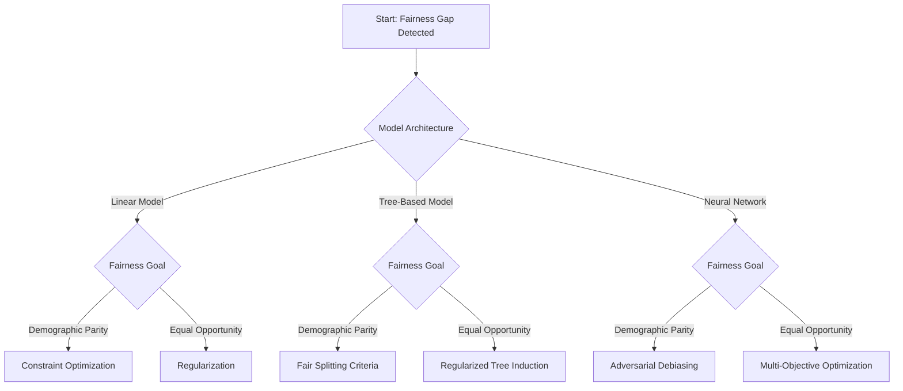

# In-Processing Fairness Toolkit

A Practical Framework for Integrating Fairness Directly into Model Training

## Introduction

Machine learning models can produce biased outcomes even when training data has been carefully prepared.  
Pre-processing techniques help mitigate bias in datasets, but they cannot fully prevent models from learning discriminatory patterns during training.

Bias may persist because:

- models exploit **proxy relationships** between features and protected attributes  
- decision boundaries amplify **historical correlations**  
- optimization objectives prioritize predictive accuracy without fairness considerations  
- complex architectures encode protected information in **latent representations**

These mechanisms mean that fairness must sometimes be addressed **within the learning algorithm itself**.

The **In-Processing Fairness Toolkit** provides a structured framework for embedding fairness directly into model training.

The toolkit helps teams:

- evaluate which fairness techniques are compatible with their model architecture  
- select appropriate in-processing interventions based on fairness goals  
- integrate fairness objectives into training algorithms  
- manage fairness–performance trade-offs systematically  
- verify fairness improvements through rigorous testing  

Rather than applying fairness techniques blindly, the toolkit focuses on **matching model characteristics and fairness objectives to appropriate algorithmic interventions**.

---

## Relationship to Other Fairness Toolkits

The **In-Processing Fairness Toolkit** complements the earlier components of the Fairness Intervention Playbook.

| Stage | Toolkit | Purpose |
|------|--------|--------|
| Bias Diagnosis | Causal Fairness Toolkit | Identify causal mechanisms behind disparities |
| Data Intervention | Pre-Processing Fairness Toolkit | Mitigate bias in training datasets |
| Model Intervention | **In-Processing Fairness Toolkit** | Integrate fairness constraints during training |
| Prediction Intervention | Post-Processing Fairness Toolkit | Adjust model outputs after training |  

Pre-processing methods improve the **data used to train models**, while in-processing techniques modify **how models learn from that data**.

---

## Toolkit Overview

The In-Processing Fairness Toolkit consists of the following components:

### 1️⃣ [Model Architecture Analysis Template](#classification)
- 1.1 Model Type Classification
- 1.2 Model Characteristics
- 1.3 Technical Constraints
- 1.4 Compatibility Matrix
- 1.5 Implementation Considerations
### 2️⃣ Technique Selection Framework
### 3️⃣ Implementation Pattern Catalog
### 4️⃣ Integration Verification Framework
### 5️⃣ User Documentation
### 6. Implementation Checklist
### 7. Practical Workflow Summary
### 8. Core Principles

---

## 1️⃣ Model Architecture Analysis Template
→ Evaluate model compatibility with in-processing fairness techniques.

Before selecting an intervention, teams must analyze the **model architecture and training constraints**.

Different fairness techniques integrate more naturally with certain model families.

---

### 1.1 Model Type Classification

Identify the model architecture currently used.

Possible categories include:

- **Linear models** (Logistic regression, Linear SVM)
- **Tree-based models** (Decision trees, Random forests, Gradient boosting)  
- **Neural networks** (Feedforward, Convolutional, Recurrent networks) 
- **Other architectures** (Probabilistic models, Ensemble methods) Specify: __________  

Document the model type and training framework used.

> _Example_
>
> The current loan approval system uses a tree-based model, specifically Gradient Boosting for binary classification.
>   
> Category:  
> **Tree-based models**
>     
> Model used:  
> **Gradient Boosting Classifier**
>    
> Reason for selection:  
> - Handles **tabular financial data well**  
> - Captures **non-linear relationships** between applicant attributes and approval probability  
> - Performs better than linear models in internal validation tests  

---

### 1.2 Model Characteristics

Record important training properties.

Example attributes include:

- Training approach (batch / online)
- Loss function
- Regularization methods
- Hyperparameter tuning strategy
- Optimization algorithm

These properties affect how fairness objectives can be integrated into training.

> _Example_
>
> **Training approach**  
> - Batch training using historical loan application data  
>   
> **Loss function**  
> - Logistic loss (binary cross-entropy)  
>   
> **Regularization methods currently used**  
> - Tree depth limitation  
> - Learning rate shrinkage  
> - Minimum samples per leaf  
>   
> **Hyperparameter tuning approach**  
> - Grid search with cross-validation  
> - Evaluation based on **AUC and accuracy**
>
> **Optimization algorithm**
> - Gradient Boosting optimization, where trees are added sequentially to minimize the loss function.  

---

### 1.3 Technical Constraints

Identify constraints that may affect fairness implementation.

Important factors include:

- Computational resources available
- Acceptable increase in training time
- Model explainability requirements
- Deployment environment limitations

Some fairness approaches introduce additional computational complexity or reduce interpretability.

> _Example_
>
> **Available computational resources**  
> - Standard CPU environment  
> - No GPU dependency  
>
> **Maximum acceptable training time increase**  
> - Up to 40% longer training time if fairness constraints are added  
>
> **Explainability requirements**  
> - High explainability required for regulatory compliance  
> - Tree-based models preferred due to interpretability  
>
> **Deployment environment limitations**  
> - Model deployed in bank decision API  
> - Prediction latency must remain under 200 ms

---

### 1.4 Compatibility Matrix

Different fairness techniques integrate differently across model families.

| Fairness Technique | Linear Models | Tree-Based Models | Neural Networks |
|---|---|---|---|
| Constraint Optimization | High | Low | Medium |
| Adversarial Debiasing | Low | Low | High |
| Fairness Regularization | High | Medium | High |
| Fair Representations | Medium | Low | High |
| Specialized Algorithms | Medium | High | Low |

---

### 1.5 Implementation Considerations

For each model type, document:

- Technical limitations affecting fairness implementation  
- Modification approaches with least disruption  
- Performance impact expectations  
- Explainability implications  

This analysis ensures that fairness interventions **fit within the existing technical ecosystem**.

---

## 2️⃣ Technique Selection Framework
→ Match fairness goals and model architectures to in-processing interventions.

Selecting an appropriate fairness technique depends on:

- model architecture
- fairness definition
- technical constraints
- performance requirements

---

## Decision Flow

### Step 1: Model Architecture Identification

Common fairness definitions include:

| Model Type | Typical Algorithms | Stap to take |
|---|---|---|
| **Linear models** | Logistic regression, Linear SVM | [Step 2](#linear) |
| **Tree-based models** | Decision trees, Random forests, Gradient boosting | [Step 3](#linear) |
| **Neural networks** | Feedforward networks, CNN, RNN | [Step 4](#linear) | 
| **Other architectures** | Probabilistic models, ensemble systems | [Step 5](#linear) |

---

### Step 2: Linear Models

Linear models support fairness constraints directly in the optimization objective.  
- What fairness objective is required?

| Fairness Goal | Recommended Technique |
|---|---|
| **Demographic parity** | Constraint optimization |   
| **Equal opportunity** | Fairness regularization |   
| **Individual fairness** | Similarity-based regularization |  

---

### Step 3: Consider Technical Constraints

Important constraints include:

- training stability  
- computational cost  
- regulatory explainability requirements  

---

### Step 4: Select Primary and Secondary Techniques

In complex applications, multiple techniques may be combined.

Example combination:

| Goal | Technique |
|---|---|
| Remove representation bias | Pre-processing |
| Prevent discriminatory boundaries | Constraint optimization |
| Improve representation learning | Adversarial debiasing |

---

## 3️⃣ Implementation Pattern Catalog
→ Reusable patterns for embedding fairness in model training.

---

### 3.1 Constraint Optimization

#### Description

Constraint-based approaches incorporate fairness definitions as **explicit constraints within the optimization process**.

The model minimizes prediction error while ensuring fairness conditions are satisfied.

#### Objective Structure  
Minimize: prediction_loss(θ)  

Subject to:  
fairness_constraint(θ) ≤ ε  

#### Implementation Components

- constrained optimization objective  
- slack variables or tolerance thresholds  
- fairness metric monitoring  

#### Use Cases

- linear models  
- convex optimization problems  
- regulated applications requiring strong fairness guarantees  

### Advantages

- provides formal fairness guarantees  
- transparent mathematical formulation  

### Limitations

- can increase optimization complexity  
- strict constraints may reduce performance  

---

### 3.2 Adversarial Debiasing

#### Description

Adversarial approaches train two models simultaneously:

- a **predictor** that performs the main task  
- an **adversary** that tries to infer protected attributes  

The predictor learns representations that **prevent the adversary from succeeding**, removing protected information from the model.

#### Architecture

Components include:

- predictor network  
- adversary network  
- gradient reversal layer  

#### Objective  

Loss = prediction_loss - λ * adversary_loss  

#### Advantages

- effective for deep learning models  
- addresses hidden representation bias  

#### Limitations

- training instability possible  
- computationally intensive  

---

### 3.3 Fairness Regularization

#### Description

Regularization methods incorporate fairness penalties into the loss function.

Instead of enforcing strict fairness constraints, these techniques **penalize unfair outcomes** during training.

#### Objective  

Loss = prediction_loss + λ * fairness_penalty  

#### Examples of Fairness Penalties

- demographic parity penalty  
- equal opportunity penalty  
- subgroup disparity penalty  

#### Advantages

- flexible fairness-performance trade-off  
- integrates easily into many models  

#### Limitations

- fairness guarantees weaker than constraint methods  
- requires careful parameter tuning  

---

### 3.4 Multi-Objective Optimization

#### Description

Multi-objective approaches treat fairness and predictive performance as **separate optimization objectives**.

Rather than optimizing a single objective, models explore the trade-off space between competing goals.

#### Objective Form 

Loss = w1 * performance_loss  
+ w2 * fairness_loss

#### Implementation Methods

- scalarization  
- ε-constraint optimization  
- Pareto frontier exploration  

#### Advantages

- transparent trade-off exploration  
- supports multiple fairness criteria  

#### Limitations

- requires training multiple models  
- higher computational cost  

---

## 4️⃣ Integration Verification Framework
→ Validate fairness improvements after implementation.

---

### 4.1 Baseline Establishment

Before implementing fairness interventions:

1. Train the baseline model  
2. Measure performance metrics  
3. Measure fairness metrics  

Example metrics:

- AUC  
- accuracy  
- demographic parity difference  
- equal opportunity difference  

---

### 4.2 Intervention Evaluation

After implementing fairness techniques:

- retrain the model with fairness intervention  
- compare fairness and performance metrics  
- analyze subgroup behavior  

---

### 4.3 Robustness Testing

Ensure fairness improvements generalize.

Recommended tests include:

- validation across demographic subgroups  
- sensitivity to hyperparameter changes  
- evaluation across different training splits  

---

### 4.4 Success Criteria

Typical success thresholds include:

| Criterion | Example |
|---|---|
| Fairness improvement | ≥50% reduction in disparity |
| Performance drop | ≤5% decrease in accuracy |
| Stability | consistent results across runs |

---

## 5️⃣ User Documentation
→ Guidelines for applying the toolkit.

Users should follow the toolkit through the following steps:

1. Analyze model architecture  
2. Identify fairness objectives  
3. Select appropriate in-processing technique  
4. Implement fairness interventions  
5. Evaluate fairness and performance trade-offs  
6. Validate model robustness  

All decisions should be documented to ensure transparency.

---

## 6️⃣ Implementation Checklist

Before deploying fairness-aware models:

### Architecture Analysis

- [ ] model type identified  
- [ ] compatibility matrix evaluated  

### Technique Selection

- [ ] fairness objective defined  
- [ ] appropriate technique selected  

### Implementation

- [ ] fairness objectives integrated into training  
- [ ] hyperparameters tuned  

### Evaluation

- [ ] fairness metrics measured  
- [ ] performance metrics evaluated  
- [ ] robustness tested  

---

## 7️⃣ Practical Workflow Summary

1. Conduct model architecture analysis  
2. Identify fairness objectives  
3. Select compatible fairness technique  
4. Integrate fairness into training pipeline  
5. Evaluate fairness and performance  
6. Deploy fairness-aware model  
7. Monitor fairness over time  

---

## 8️⃣ Core Principles

Effective in-processing fairness interventions should:

- address **bias within model training**  
- balance fairness with predictive performance  
- maintain model stability and reliability  
- consider intersectional fairness impacts  
- remain transparent and auditable  
- integrate smoothly with existing ML pipelines  
- support continuous monitoring and improvement

---

For sources that informed this toolkit, see the [0_References](https://github.com/monikase/AI_Ethics/blob/main/Fairness_Intervention_Playbook/0_References.md)
