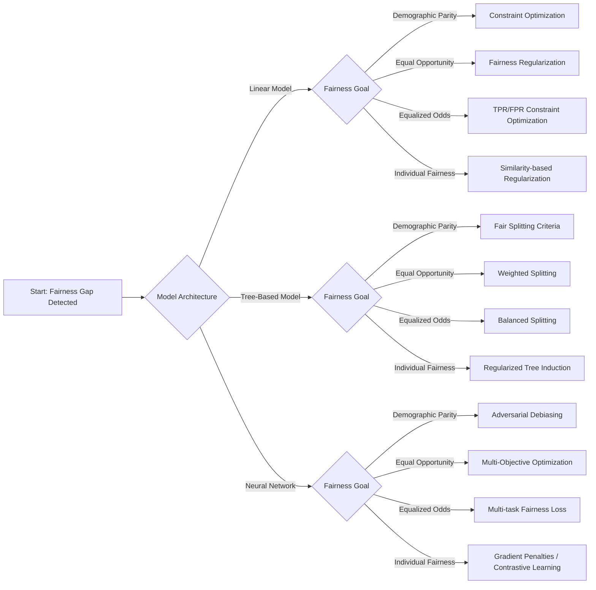

# In-Processing Fairness Toolkit

A Practical Framework for Integrating Fairness Directly into Model Training

## Introduction

Machine learning models can produce biased outcomes even when training data has been carefully prepared.  
Pre-processing techniques help mitigate bias in datasets, but they cannot fully prevent models from learning discriminatory patterns during training.

Bias may persist because:

- models exploit **proxy relationships** between features and protected attributes  
- decision boundaries amplify **historical correlations**  
- optimization objectives prioritize predictive accuracy without fairness considerations  
- complex architectures encode protected information in **latent representations**

These mechanisms mean that fairness must sometimes be addressed **within the learning algorithm itself**.

The **In-Processing Fairness Toolkit** provides a structured framework for embedding fairness directly into model training.

The toolkit helps teams:

- evaluate which fairness techniques are compatible with their model architecture  
- select appropriate in-processing interventions based on fairness goals  
- integrate fairness objectives into training algorithms  
- manage fairness–performance trade-offs systematically  
- verify fairness improvements through rigorous testing  

Rather than applying fairness techniques blindly, the toolkit focuses on **matching model characteristics and fairness objectives to appropriate algorithmic interventions**.

---

## Relationship to Other Fairness Toolkits

The **In-Processing Fairness Toolkit** complements the earlier components of the Fairness Intervention Playbook.

| Stage | Toolkit | Purpose |
|------|--------|--------|
| Bias Diagnosis | Causal Fairness Toolkit | Identify causal mechanisms behind disparities |
| Data Intervention | Pre-Processing Fairness Toolkit | Mitigate bias in training datasets |
| Model Intervention | **In-Processing Fairness Toolkit** | Integrate fairness constraints during training |
| Prediction Intervention | Post-Processing Fairness Toolkit | Adjust model outputs after training |  

Pre-processing methods improve the **data used to train models**, while in-processing techniques modify **how models learn from that data**.

---

## Toolkit Overview

The In-Processing Fairness Toolkit consists of the following components:

### 1️⃣ [Model Architecture Analysis Template](#classification)
- 1.1 Model Type Classification
- 1.2 Model Characteristics
- 1.3 Technical Constraints
- 1.4 Compatibility Matrix
- 1.5 Implementation Considerations
### 2️⃣ [Technique Selection Framework](#technique)
### 3️⃣ [Implementation Pattern Catalog](#implementation)  
- 3.1 Constraint Optimization
- 3.2 Adversarial Debiasing
- 3.3 Fairness Regularization
- 3.4 Multi-Objective Optimization  
### 4️⃣ [Integration Verification Framework](#integration)
### 5. [User Documentation](#documentation)
### 6. [Implementation Checklist](#checklist)
### 7. [Practical Workflow Summary](#summary)
### 8. [Core Principles](#core)

---

## 1️⃣ Model Architecture Analysis Template
→ Evaluate model compatibility with in-processing fairness techniques.

Before selecting an intervention, teams must analyze the **model architecture and training constraints**.

Different fairness techniques integrate more naturally with certain model families.

---

### 1.1 Model Type Classification

Identify the model architecture currently used.

Possible categories include:

- **Linear models** (Logistic regression, Linear SVM)
- **Tree-based models** (Decision trees, Random forests, Gradient boosting)  
- **Neural networks** (Feedforward, Convolutional, Recurrent networks) 
- **Other architectures** (Probabilistic models, Ensemble methods) Specify: __________  

Document the model type and training framework used.

> _Example_
>
> The current loan approval system uses a tree-based model, specifically Gradient Boosting for binary classification.
>   
> Category:  
> **Tree-based models**
>     
> Model used:  
> **Gradient Boosting Classifier**
>    
> Reason for selection:  
> - Handles **tabular financial data well**  
> - Captures **non-linear relationships** between applicant attributes and approval probability  
> - Performs better than linear models in internal validation tests  

---

### 1.2 Model Characteristics

Record important training properties.

Example attributes include:

- Training approach (batch / online)
- Loss function
- Regularization methods
- Hyperparameter tuning strategy
- Optimization algorithm

These properties affect how fairness objectives can be integrated into training.

> _Example_
>
> **Training approach**  
> - Batch training using historical loan application data  
>   
> **Loss function**  
> - Logistic loss (binary cross-entropy)  
>   
> **Regularization methods currently used**  
> - Tree depth limitation  
> - Learning rate shrinkage  
> - Minimum samples per leaf  
>   
> **Hyperparameter tuning approach**  
> - Grid search with cross-validation  
> - Evaluation based on **AUC and accuracy**
>
> **Optimization algorithm**
> - Gradient Boosting optimization, where trees are added sequentially to minimize the loss function.  

---

### 1.3 Technical Constraints

Identify constraints that may affect fairness implementation.

Important factors include:

- Computational resources available
- Acceptable increase in training time
- Model explainability requirements
- Deployment environment limitations

Some fairness approaches introduce additional computational complexity or reduce interpretability.

> _Example_
>
> **Available computational resources**  
> - Standard CPU environment  
> - No GPU dependency  
>
> **Maximum acceptable training time increase**  
> - Up to 40% longer training time if fairness constraints are added  
>
> **Explainability requirements**  
> - High explainability required for regulatory compliance  
> - Tree-based models preferred due to interpretability  
>
> **Deployment environment limitations**  
> - Model deployed in bank decision API  
> - Prediction latency must remain under 200 ms

---

### 1.4 Compatibility Matrix

Different fairness techniques integrate differently across model families.

| Fairness Technique | Linear Models | Tree-Based Models | Neural Networks |
|---|---|---|---|
| Constraint Optimization | High | Low | Medium |
| Adversarial Debiasing | Low | Low | High |
| Fairness Regularization | High | Medium | High |
| Fair Representations | Medium | Low | High |
| Specialized Algorithms | Medium | High | Low |

---

### 1.5 Implementation Considerations

For each model type, document:

- Technical limitations affecting fairness implementation  
- Modification approaches with least disruption  
- Performance impact expectations  
- Explainability implications  

This analysis ensures that fairness interventions **fit within the existing technical ecosystem**.

---

## 2️⃣ Technique Selection Framework
→ Match fairness goals and model architectures to in-processing interventions.

Selecting an appropriate fairness technique depends on:

- model architecture
- fairness definition
- technical constraints
- performance requirements

---

## Decision Flow

### Step 1: Model Architecture Identification

Different fairness techniques integrate differently depending on model architecture.  

| Model Type | Typical Algorithms | Step to take |
|---|---|---|
| **Linear models** | Logistic regression, Linear SVM | [Step 2](#linear) |
| **Tree-based models** | Decision trees, Random forests, Gradient boosting | [Step 3](#tree) |
| **Neural networks** | Feedforward networks, CNN, RNN | [Step 4](#neural) | 
| **Other architectures** | Probabilistic models, ensemble systems | [Step 5](#other) |

---

### Step 2: Linear Models

Linear models support fairness constraints directly in the optimization objective.  

| Fairness Goal | Recommended Technique |
|---|---|
| **Demographic parity** | Constraint optimization with optimization-based preprocessing |   
| **Equal opportunity** | Constraint optimization with adjusted thresholds |  
| **Equalized odds** | Constraint optimization with TPR/FPR constraints |  
| **Individual fairness** | Similarity-based regularization |  

---

### Step 3: Tree-Based Models

Tree-based models require fairness mechanisms integrated into splitting criteria or training weights.   

| Fairness Goal | Recommended Technique |
|---|---|
| **Demographic parity** | Fair splitting criteria |   
| **Equal opportunity** | Fair splitting with weighted samples |  
| **Equalized odds** | Balanced splitting criteria |  
| **Individual fairness** | Regularized tree induction |  

---

### Step 4: Neural Networks

Neural networks allow fairness interventions through architectural changes and multi-task training.    

| Fairness Goal | Recommended Technique |
|---|---|
| **Demographic parity** | Adversarial debiasing |   
| **Equal opportunity** | Multi-objective optimization |   
| **Equalized odds** | Multi-task fairness loss |  
| **Individual fairness** | Gradient penalties or contrastive learning |  

---

### Step 5: Other Model Architectures

Some systems use hybrid or specialized models where direct integration may be difficult.  
Recommended approaches include:  

| Situation | Recommended Strategy |
|---|---|
| Limited ability to modify training algorithm | Use pre-processing fairness methods |   
| Model architecture is fixed | Apply post-processing fairness adjustments |   
| Complex ensemble models | Combine fairness regularization with monitoring |  

---

## 3️⃣ Implementation Pattern Catalog
→ Reusable patterns for embedding fairness in model training.

---

### 3.1 Constraint Optimization

---

#### Description
Constraint-based approaches incorporate fairness definitions as **explicit constraints within the optimization process**.  
The model minimizes prediction error while ensuring fairness conditions are satisfied.   

---

#### Objective Structure

Minimize: $\min_{\theta} L(\theta)$  

Subject to: $C_i(\theta) \le \varepsilon_i \quad \forall i \in \{1,2,\ldots,k\}$  

Where:  

- $L(\theta)$ - prediction loss function minimized during training  
- $C_i(\theta)$ - fairness constraint for subgroup $i$  
- $\theta$ - model parameters  
- $\varepsilon_i$ - tolerance level allowed for fairness violations  
- $k$ - number of fairness constraints or protected subgroups  

**Interpretation**    

This formulation trains the model to **achieve the best predictive performance while ensuring that fairness constraints remain within acceptable limits for all protected groups or subgroups.**    

---

#### Components

- Modified objective function with fairness constraints  
- Relaxation parameters or slack variables for constraint satisfaction  
- Fairness metric monitoring and optimization adjustments during training  

---

#### Parameters

- Constraint weight ($\lambda$) controlling the fairness–performance trade-off  
- Tolerance threshold ($\varepsilon$) for allowable constraint violations  
- Convergence criteria adjustments for constrained optimization  

---

#### Implementation Considerations

- May require specialized optimization solvers  
- Training time may increase by **30–50%**  
- Works best with **convex loss functions**

---

#### Use Cases

- Linear models  
- Convex optimization problems  
- Regulated applications requiring strong fairness guarantees  

---

#### Advantages

- Provides formal fairness guarantees  
- Transparent mathematical formulation  

---

#### Limitations

- Increases optimization complexity  
- Strict constraints may reduce predictive performance

---

#### Intersectionality Consideration  

To address intersectional bias, constraint-based approaches can be extended by:   

- Defining **separate fairness constraints for important intersectional subgroups**   
- Incorporating **multiple protected attributes simultaneously** in the constraint formulation   
- Using hierarchical or aggregated constraint structures that monitor fairness at different levels of demographic granularity   

These extensions help ensure that fairness guarantees apply not only to individual protected groups but also to **intersectional subgroups that may otherwise remain undetected**.   

---

### 3.2 Adversarial Debiasing

---

#### Description

Adversarial debiasing trains two models simultaneously:

- a **predictor** that performs the primary prediction task  
- an **adversary** that attempts to infer protected attributes from the model’s internal representations  

During training, the predictor learns representations that **maximize prediction accuracy while preventing the adversary from successfully predicting protected attributes**.    
This encourages the model to remove sensitive information from learned representations.

---

#### Architecture

The architecture typically includes the following components:  

- Predictor network (main prediction model)  
- Adversary network attempting to predict protected attributes  
- Gradient reversal layer that reverses gradients from the adversary during backpropagation  
- Connection point between predictor and adversary (model output or internal representation layer)

---

#### Objective Structure

Minimize: $\min_{\theta_p} L_{pred}(\theta_p) - \lambda L_{adv}(\theta_p,\theta_a)$  

Where:  

- $L_{pred}$ - prediction loss of the main model  
- $L_{adv}$ - adversary loss predicting protected attributes  
- $\theta_p$ - parameters of the predictor model  
- $\theta_a$ - parameters of the adversary network  
- $\lambda$ - adversary weight controlling the fairness–performance trade-off  

**Interpretation**  

The model is trained to **optimize prediction accuracy while simultaneously making it difficult for the adversary to recover protected attributes from the model’s representations**.  

---

#### Components

- main model architecture (predictor)  
- adversary network architecture  
- gradient reversal layer for adversarial training  
- combined loss function integrating prediction and adversary objectives  

---

#### Parameters

- **Adversary weight ($\lambda$)** controlling the fairness–performance trade-off  
- **Adversary architecture complexity** (depth or size of adversary network)  
- **Gradient scaling factor** controlling adversarial influence during training  

---

#### Implementation Considerations

- Requires careful balancing of predictor and adversary training  
- Improper hyperparameters may lead to **training instability**  
- Adversarial weight ($\lambda$) is often **increased gradually during training** to stabilize learning  
- Works best with **large datasets and neural network architectures**

---

#### Use Cases

- Neural networks and deep learning models  
- Representation learning tasks  
- Applications where bias emerges from **latent feature representations**

---

#### Advantages

- Effective at removing bias from learned representations  
- Flexible and compatible with many neural network architectures  

---

#### Limitations

- Computationally intensive  
- Sensitive to hyperparameter selection  
- Training process may become unstable  

---

#### Intersectionality Consideration  

To address intersectional bias, adversarial architectures can be extended by:  

- Predicting **combinations of protected attributes**    
- Using **multi-task adversaries** that predict multiple protected attributes simultaneously   
- Applying hierarchical adversarial structures that monitor both individual attributes and their intersections   

These extensions help ensure that fairness protections apply to **all demographic subgroups**, including intersectional groups that may otherwise remain undetected.   

---

### 3.3 Fairness Regularization

---

#### Description

Fairness regularization incorporates fairness penalties directly into the model's loss function.  
Instead of enforcing strict fairness constraints, these techniques **penalize unfair outcomes during training**, allowing the model to balance predictive accuracy and fairness through a tunable penalty term.  

---

#### Objective Structure

Minimize: $\min_{\theta} \; L(\theta) + \lambda \, R_{fair}(\theta)$  

Where:  

- $L(\theta)$ - prediction loss of the model  
- $R_{fair}(\theta)$ - fairness penalty measuring disparity between protected groups  
- $\theta$ - model parameters  
- $\lambda$ - regularization weight controlling the fairness–performance trade-off  

**Interpretation**  

The model is trained to **optimize predictive performance while discouraging unfair outcomes** through an additional fairness penalty term that reduces disparities between demographic groups.  

---

#### Components

- Base prediction model  
- Fairness penalty term added to the loss function  
- Fairness metric monitoring during training  

---

#### Parameters

- **Regularization weight ($\lambda$)** controlling the fairness–performance trade-off  
- **Fairness penalty definition** (e.g., demographic parity or equal opportunity)  
- **Training schedule adjustments** if the fairness penalty is gradually introduced  

---

#### Implementation Considerations

- Fairness penalties should be differentiable to integrate with gradient-based optimization  
- Penalty strength may require careful tuning to avoid large performance degradation  
- Integration differs by model type:
  - **Linear models** — fairness penalties added directly to the objective function  
  - **Tree-based models** — splitting criteria modified to incorporate fairness penalties  
  - **Neural networks** — fairness penalties implemented through custom loss functions  
- Regularization strength is typically tuned using **grid search or cross-validation** to explore fairness–performance trade-offs  

---

#### Examples of Fairness Penalties

- **Demographic parity penalty** - penalizes differences in positive prediction rates across groups  
- **Equal opportunity penalty** - penalizes disparities in true positive rates  
- **Subgroup disparity penalty** - penalizes prediction differences across demographic subgroups  

---

#### Use Cases

- Linear models and logistic regression  
- Neural networks with gradient-based optimization  
- Applications requiring **flexible fairness-performance trade-offs**

---

#### Advantages

- Flexible balance between fairness and accuracy  
- Easy to integrate into existing training pipelines  
- Compatible with many model architectures  

---

#### Limitations

- Fairness guarantees weaker than strict constraint methods  
- Requires careful tuning of the regularization parameter  
- Fairness improvements may depend strongly on the chosen penalty formulation  

---

#### Intersectionality Consideration

Models may appear fair across broad demographic groups while still discriminating against **specific intersectional subgroups**, a phenomenon sometimes referred to as *fairness gerrymandering*.

To address intersectional bias, regularization approaches can be extended by:

- Defining **fairness penalties for intersectional subgroup disparities**  
- Combining penalties across **multiple protected attributes simultaneously**  
- Monitoring fairness metrics across **overlapping demographic groups**

These extensions help ensure that fairness regularization protects **all demographic subgroups**, including intersectional populations that might otherwise remain overlooked.

---

### 3.4 Multi-Objective Optimization

---

#### Description

Multi-objective approaches treat fairness and predictive performance as **separate optimization objectives**.  

Instead of optimizing a single loss function, the model explores the **trade-off space between competing goals**, such as predictive accuracy and fairness.  
This approach allows practitioners to analyze multiple possible solutions and select the most appropriate balance between performance and fairness.  

---

#### Objective Structure

Minimize: $\min_{\theta} \; w_1 L_{perf}(\theta) + w_2 L_{fair}(\theta)$

Where:

- $L_{perf}(\theta)$ - prediction performance loss  
- $L_{fair}(\theta)$ - fairness loss measuring disparity across groups  
- $\theta$ - model parameters  
- $w_1, w_2$ - weights controlling the relative importance of performance and fairness objectives  

**Interpretation**

The model simultaneously optimizes predictive performance and fairness by adjusting the relative importance of each objective.

---

#### Components

- Base prediction model  
- Fairness objective measuring group disparities  
- Optimization procedure capable of handling multiple objectives  
- Evaluation framework for comparing trade-off solutions  

---

#### Parameters

- **Objective weights ($w_1, w_2$)** controlling the fairness–performance trade-off  
- **Fairness objective definition** (e.g., demographic parity or equal opportunity)  
- **Search strategy** for exploring the trade-off space  

---

#### Implementation Methods

- **Scalarization** - combining objectives using weighted sums  
- **ε-constraint optimization** - optimizing performance while enforcing fairness bounds  
- **Pareto frontier exploration** - identifying solutions where improving one objective worsens another  

---

#### Implementation Considerations

- Generating the Pareto frontier typically requires **training multiple models**  
- Computational cost increases with the number of objectives  
- Visualization tools are useful for analyzing fairness–performance trade-offs  
- Model selection often requires **stakeholder input to choose acceptable trade-offs**

---

#### Use Cases

- Neural networks and complex models with flexible optimization  
- Applications requiring **explicit fairness–performance trade-off analysis**  
- Decision systems where stakeholders must evaluate multiple candidate solutions  

---

#### Advantages

- Transparent exploration of fairness–performance trade-offs  
- Supports multiple fairness criteria simultaneously  
- Enables stakeholders to select solutions aligned with policy or regulatory goals  

---

#### Limitations

- Requires training multiple models to explore trade-offs  
- Computationally expensive for large models or datasets  
- Decision-making may become complex when many objectives are considered  

---

#### Intersectionality Consideration

To address intersectionality, multi-objective optimization can be extended by:

- Defining **fairness objectives for intersectional subgroup performance**
- Evaluating fairness across **all relevant demographic combinations**
- Exploring trade-offs across multiple fairness metrics simultaneously

These extensions ensure that fairness optimization protects **all demographic groups**, including intersectional populations that might otherwise be overlooked. 

---

## 4️⃣ Integration Verification Framework
→ Validate fairness improvements after implementation.

---

### 4.1 Baseline Establishment

Before implementing fairness interventions:

1. Train the baseline model without fairness intervention  
2. Measure performance metrics  
3. Measure fairness metrics  

Example metrics include:

- AUC  
- accuracy  
- demographic parity difference  
- equal opportunity difference  

Document these metrics to create a **baseline reference for later comparison**.

---

### 4.2 Intervention Evaluation

After implementing fairness techniques:

- retrain the model with fairness intervention  
- compare fairness and performance metrics against the baseline  
- analyze subgroup behavior across protected attributes  

This step verifies whether fairness improvements are achieved **without unacceptable performance degradation**.

---

### 4.3 Robustness Testing

Ensure fairness improvements generalize across different conditions.

Recommended tests include:

- validation across demographic subgroups  
- sensitivity to hyperparameter changes  
- evaluation across different training splits  
- behavior under potential **distribution shifts**

---

### 4.4 Success Criteria

Typical success thresholds include:

| Criterion | Example |
|---|---|
| Fairness improvement | ≥50% reduction in disparity |
| Performance drop | ≤5% decrease in accuracy |
| Stability | consistent results across runs |

---

## 5. User Documentation
→ Guidelines for applying the toolkit.

Users should follow the toolkit through the following steps:

1. Analyze model architecture  
2. Identify fairness objectives  
3. Select appropriate in-processing technique  
4. Implement fairness interventions  
5. Evaluate fairness and performance trade-offs  
6. Validate model robustness  

All decisions should be documented to ensure transparency.

---

## 6. Implementation Checklist

Before deploying fairness-aware models:  

### Architecture Analysis

- [ ] model type identified  
- [ ] model characteristics documented  
- [ ] technical constraints evaluated  
- [ ] compatibility matrix reviewed  

### Technique Selection

- [ ] fairness objective defined  
- [ ] appropriate in-processing technique selected  

### Implementation

- [ ] fairness objectives integrated into training  
- [ ] model retrained with fairness intervention  
- [ ] hyperparameters tuned  

### Evaluation

- [ ] baseline performance and fairness metrics documented  
- [ ] fairness metrics measured after intervention  
- [ ] performance impact evaluated  
- [ ] robustness tests completed  
- [ ] success criteria satisfied

---

## 7. Practical Workflow Summary

1. Conduct model architecture analysis  
2. Identify fairness objectives  
3. Select compatible fairness technique  
4. Integrate fairness into training pipeline  
5. Evaluate fairness and performance  
6. Deploy fairness-aware model  
7. Monitor fairness over time  

---

## 8. Core Principles

Effective in-processing fairness interventions should:

- address **bias within model training**  
- balance fairness with predictive performance  
- maintain model stability and reliability  
- consider intersectional fairness impacts  
- remain transparent and auditable  
- integrate smoothly with existing ML pipelines  
- support continuous monitoring and improvement

---

For sources that informed this toolkit, see the [0_References](https://github.com/monikase/AI_Ethics/blob/main/Fairness_Intervention_Playbook/0_References.md)
