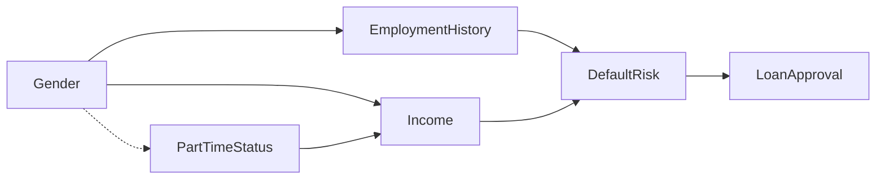

# Case Study: Addressing Gender Bias in a Loan Approval System

## 1. Scenario Overview

A mid-sized bank uses a machine learning model to assist with **loan approval decisions**. The system predicts the probability that an applicant will default on a loan based on financial and employment data.

A fairness audit revealed a concerning pattern:

| Group | Loan Approval Rate |
|------|-------------------|
| Men | 74% |
| Women | 58% |

Further analysis suggests that women — particularly **women returning to the workforce after career breaks** — are significantly more likely to be denied loans despite having similar financial characteristics to male applicants.

The engineering team must determine:

- Why this disparity occurs
- Which fairness interventions are appropriate
- How to implement them without disrupting the existing system

The **Fairness Intervention Playbook** is applied to guide this process.

The workflow proceeds through four stages:

1. **Causal Fairness Toolkit** — identify causal mechanisms behind disparities  
2. **Pre-Processing Fairness Toolkit** — correct bias in training data  
3. **In-Processing Fairness Toolkit** — integrate fairness constraints into model training  
4. **Post-Processing Fairness Toolkit** — adjust model predictions if disparities remain  

---

## 2. Stage 1 — Causal Fairness Toolkit
### Identify the Root Cause of Disparities

The first step is to determine **why gender disparities occur in the model’s predictions**.

The Causal Fairness Toolkit helps identify how protected attributes influence outcomes through causal pathways.

---

### 2.1 Variable Identification

Protected attribute:

- Gender

Potential mediators:

- Employment history  
- Income level  
- Part-time employment status  

Outcome variable:

- Loan approval decision

Legitimate predictors:

- Debt-to-income ratio  
- Credit score  
- Savings history  
- Payment history  

Proxy variables suspected:

- Part-time employment status  
- Career interruptions  

---

### 2.2 Causal Graph

The causal relationships between variables are represented using a directed acyclic graph.



Key causal pathways identified:

1. Gender → Employment History → Default Risk → Loan Approval  
2. Gender → Income → Default Risk → Loan Approval  
3. Gender → Part-Time Status → Income Stability → Default Risk  

---

### 2.3 Counterfactual Analysis

A counterfactual fairness test evaluates whether changing only the protected attribute would change the decision.

Example:

| Scenario | Predicted Default Risk | Loan Decision |
|--------|-----------------------|--------------|
| Female applicant | 17% | Denied |
| Same applicant (male counterfactual) | 12% | Approved |

Result:

The prediction changes **only because gender changed**, indicating **counterfactual unfairness**.

---

### 2.4 Path-Specific Effect Analysis

Estimated contribution of each pathway:

| Pathway | Contribution to disparity |
|------|-----------------------------|
| Gender → Employment history | 42% |
| Gender → Income | 28% |
| Gender → Part-time status | 20% |
| Direct gender effect | 10% |

Conclusion:

The largest source of bias occurs through **employment history and income variables influenced by gender**.

---

### 2.5 Intervention Point Selection

Using the Causal Intervention Decision Tree, the team determines:

- Mediator variables influenced by gender create unfair outcomes  
- Proxy variables such as part-time status amplify disparities  

Recommended interventions:

- Pre-processing data corrections
- Fairness-aware model training
- Post-processing threshold adjustment if disparities remain

---

## 3. Stage 2 — Pre-Processing Fairness Toolkit
### Correct Bias in Training Data

The Pre-Processing Toolkit focuses on **bias within the dataset itself**.

---

### 3.1 Representation Analysis

Dataset composition:

| Group | Applicant population | Training dataset |
|------|----------------------|------------------|
| Men | 54% | 72% |
| Women | 46% | 28% |

Women are significantly **underrepresented in the training dataset**.

Intersectional analysis:

| Group | Dataset share |
|------|---------------|
| Women | 28% |
| Women over 45 | 9% |

Older women are particularly underrepresented.

---

### 3.2 Proxy Detection

Correlation analysis shows:

| Feature | Correlation with Gender |
|------|--------------------------|
| Part-time employment | 0.47 |
| Career interruptions | 0.39 |
| Industry sector | 0.31 |

These features act as **proxies for gender**.

---

### 3.3 Label Bias Assessment

Historical approval rates:

| Group | Approval Rate |
|------|---------------|
| Men | 74% |
| Women | 58% |

Given similar financial profiles, this disparity suggests **historical label bias** in past loan decisions.

---

### 3.4 Pre-Processing Interventions

Three interventions are implemented.

#### Representation balancing

Women are oversampled in the training dataset.

#### Outcome-aware reweighting

Training examples receive weights based on group–outcome combinations to reduce historical bias.

#### Feature transformation

Employment history is transformed into a new variable:

```
Total Relevant Experience
```

This metric measures accumulated work experience without penalizing temporary career breaks.

---

### 3.5 Result

After pre-processing:

- Gender imbalance in training data is reduced  
- Proxy influence decreases  
- Historical label bias is partially corrected  

The dataset is now ready for fairness-aware model training.

---

## 4. Stage 3 — In-Processing Fairness Toolkit
### Integrate Fairness Into Model Training

The loan approval model uses **Gradient Boosting**, a tree-based architecture.

---

### 4.1 Model Architecture Analysis

Model type:

- Gradient Boosting Classifier

Key properties:

- Binary classification  
- Logistic loss function  
- Tabular financial data  

Constraints:

- High explainability required for regulatory compliance  
- Prediction latency must remain under 200 milliseconds  

---

### 4.2 Technique Selection

Based on the toolkit decision framework:

| Fairness goal | Selected method |
|------|----------------|
| Equal opportunity | Fairness regularization |
| Demographic parity | Balanced splitting criteria |

---

### 4.3 Fairness Regularization

The training objective becomes:

```
Minimize:
Prediction Loss + λ × Fairness Penalty
```

Where the fairness penalty measures disparities in **true positive rates across gender groups**.

---

### 4.4 Training Results

| Metric | Baseline | After intervention |
|------|---------|--------------------|
| Accuracy | 0.84 | 0.82 |
| AUC | 0.87 | 0.85 |
| Equal opportunity gap | 11% | 4% |

Fairness improves significantly with minimal performance loss.

However, some disparities remain in final decisions.

---

## 5. Stage 4 — Post-Processing Fairness Toolkit
### Adjust Model Predictions

Post-processing interventions modify predictions **after training** when retraining is limited or insufficient.

---

### 5.1 Threshold Optimization

Separate decision thresholds are applied for each group.

| Group | Approval Threshold |
|------|--------------------|
| Men | 0.50 |
| Women | 0.46 |

This adjustment equalizes **true positive rates across gender groups**.

---

### 5.2 Probability Calibration

Calibration ensures predicted risk scores reflect actual default probabilities.

Methods used:

- Platt scaling  
- Reliability diagrams  

Calibration improves the interpretability of predicted probabilities.

---

### 5.3 Decision Flipping

A small number of borderline decisions are flipped to reduce disparities.

Example:

- 1.8% of negative predictions for female applicants are flipped to positive outcomes.

---

### 5.4 Rejection Option Classification

Cases with uncertain predictions are deferred to human review.

| Prediction confidence | Action |
|----------------------|--------|
| > 0.85 | Automatic decision |
| 0.45 – 0.85 | Human review |

This ensures that **high-risk fairness cases receive manual oversight**.

---

## 6. Final Outcomes

After applying the full intervention workflow:

| Metric | Baseline | Final System |
|------|---------|--------------|
| Approval disparity | 16% | 4% |
| Equal opportunity gap | 11% | 2% |
| AUC | 0.87 | 0.84 |

Key results:

- Significant reduction in gender disparities  
- Minimal impact on predictive performance  
- Improved transparency of decision logic  

---

## 7. Lessons Learned

### Root causes must be identified first

Causal analysis revealed that disparities were driven primarily by **employment history and income pathways**, not direct gender discrimination.

### Data-level interventions are often the most effective

Pre-processing corrections addressed many fairness issues before model training began.

### Multiple interventions are often required

No single fairness technique solved the problem. A combination of:

- data corrections  
- fairness-aware model training  
- prediction-level adjustments  

was necessary.

### Intersectional analysis is critical

The most severe disparities occurred for **older women with career interruptions**, which would not have been detected using gender-only analysis.

---

## 8. Implications for the Fairness Intervention Playbook

This case study demonstrates how the playbook provides:

- A structured workflow across the machine learning lifecycle
- Clear guidance for selecting fairness interventions
- Integration between causal analysis, data corrections, model training, and prediction adjustments

The playbook enables engineering teams to implement fairness interventions systematically without requiring fairness experts for every decision.
